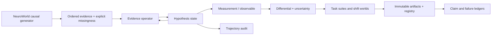

# Architecture

Q-Neuro separates the research question into replaceable parts. The central object is a state
whose disease-indexed components evolve when an observed evidence token arrives. Probability is a
measurement of that state, not the state itself.

## Package map

- `neuroworld/`: causal synthetic case generation, missingness, chronology twins, ambiguity,
  composition, omitted disease, hidden syndrome, and active-evidence tasks.
- `qneuro/models/`: conventional controls, real/complex operators, attractors, energy,
  Hamiltonian/dissipative laws, density dynamics, state-space, graph, and Hopfield variants.
- `qneuro/learning/`: backpropagation controls, multi-objective rules, PCGrad, phase-gradient,
  local plasticity, hybrid learning, and ZeroBackprop prototype.
- `qneuro/observables/`: linear and Hermitian frozen-state probes.
- `qneuro/evaluation/`: calibration, ambiguity, OOD, representations, and active acquisition.
- `qneuro/discovery/`: deterministic Pareto ranking and preregistered surprise rules.
- `experiments/`: configuration-first runners and never-overwritten `QN-XXXXXX` artifacts.
- `research/`: statistical analyses, vector/PNG figures, architecture catalog, and ledgers.
- `dashboard/`: static, data-derived evidence interface.
- `paper/`: LaTeX source, generated tables, Word manuscript, and compiled PDF.

## Core state transition

For complex operator state `z_t ∈ ℂ^H`, a token `e_t` supplies a learned low-rank,
state-conditioned update. A residual form is used in the implementation:

`z_(t+1) = normalize(z_t + α_t U(e_t, z_t)V(e_t, z_t)^† z_t + b(e_t))`.

The model measures class amplitudes `a = Wz_T + c` and returns
`p(d) = |a_d|² / Σ_j |a_j|²`. Real and two-channel controls preserve matched roles while removing
complex multiplication or conjugate phase interactions. See `docs/MATHEMATICS.md` for exact
definitions and invariants.

## Design constraints

1. Every mechanism has a conventional or real-valued control.
2. Missing evidence is distinct from observed-negative evidence.
3. Shift metrics are never used for model or temperature selection.
4. World seeds, rather than cases inside one world, are the confirmatory statistical unit.
5. Completed run directories are immutable; failed and superseded runs remain visible.
6. All outputs are research measurements on synthetic data, never medical recommendations.
