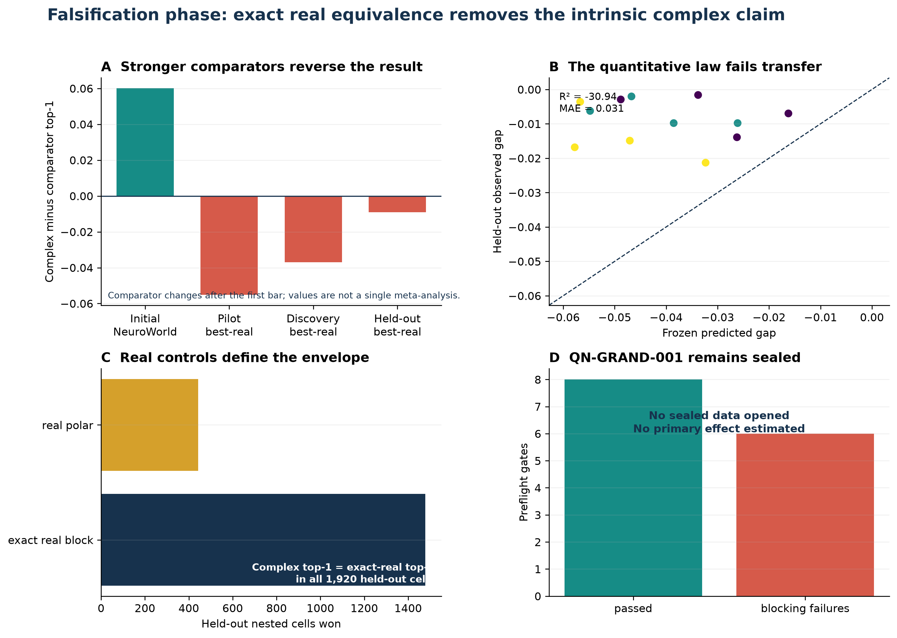

# Q-Neuro

[](https://github.com/Samyrrrrrr990/q-neuro/actions/workflows/ci.yml)
[](LICENSE)
[](docs/MODEL_CARD.md)
[](experiments/results/QN-GRAND-001/preflight.json)

Q-Neuro is a falsification-first research repository for testing structured complex-valued and
real-valued recurrent models on synthetic sequential tasks. Its central result is a reversal: an
apparent complex-valued robustness advantage disappears when the comparator is replaced by an
exact real implementation of the same computation and by stronger real-model controls.

> **SYNTHETIC, NONCLINICAL RESEARCH ONLY.** Q-Neuro has not been evaluated on patients and is not a
> medical device, diagnostic system, clinical decision-support tool, or demonstration of physical
> quantum computation.

## Main result

| Evidence stage | Registered result | Interpretation |
|---|---:|---|
| Historical NeuroWorld comparison | +0.0602 top-1 vs two-channel real | Positive but comparator-sensitive |
| Reduced discovery | 0/2,880 positive effects; mean −0.03695 vs best real | No support for an intrinsic complex advantage |
| Untouched-family confirmation | 0/1,920 positive effects; mean −0.009158 | Non-positive result transfers to four new families |
| Exact-real control | Top-1 matches in all 1,920 held-out cells | Implemented complex computation is reproducible in real arithmetic |
| Frozen quantitative law | R² −30.94; MAE 0.03126 | Failed magnitude transfer; retained as a negative result |
| QN-GRAND-001 | Blocked before execution; sealed | Six mandatory readiness gates remain unmet |

The held-out family/world/seed hierarchical bootstrap interval for the complex-minus-best-real
effect is [−0.01325, −0.00457]. These reduced studies are intentionally outcome-ineligible: they
do not replace the deferred full protocol and cannot support clinical, universal-superiority, or
grand-confirmatory claims.



## Publication package

The complete v1.0.0 results article, **Exact Real Controls Overturn an Apparent Complex-Valued
Robustness Advantage**, is available as [Word](paper/qneuro.docx), [PDF](paper/qneuro.pdf), and
modular [LaTeX](paper/main.tex). The editable manuscript is 25 pages, accessibility-audited, and
generated from canonical Markdown plus registered artifacts.

- [Manuscript build and artifact map](paper/README.md)
- [Detailed result record](RESULTS.md)
- [Next-phase preregistration](docs/PREREGISTRATION_NEXT_PHASE.md)
- [Frozen candidate law](research/laws/FROZEN_CANDIDATE_001.json)
- [Machine-readable claims](research/claims.json)
- [Failure ledger](research/failures.json)
- [Interactive evidence dashboard](dashboard/index.html)

The manuscript has not undergone journal peer review, independent replication, or external
statistical audit. Publication files are submission-ready artifacts, not a guarantee of acceptance.

## Reproduce

```bash
uv sync --extra dev --extra paper --frozen
uv run pytest -q
make dashboard
uv run python paper/build_manuscript.py
uv run python scripts/verify_release.py
```

Cached-artifact verification checks the registered result chain without retraining thousands of
models. Full experimental reruns remain separate, compute-intensive operations and must not be
confused with independent replication. See [`REPLICATION.md`](REPLICATION.md) for the exact
boundary and commands.

## Repository map

```text
experiments/             immutable run outputs, configs, registry, and runners
q_neuro/                 models, synthetic generators, training, and evaluation code
research/                preregistrations, analyses, frozen law, claims, failures, and figures
paper/                   canonical manuscript source plus DOCX/PDF/LaTeX outputs
dashboard/               static evidence audit built from versioned artifacts
tests/                   invariant, analysis, registry, safety, and release tests
release/                 checksummed publication manifest and replication report
```

## Scientific interpretation

The exact-real mapping falsifies representational uniqueness for the implemented linear complex
operator. It does not prove that every complex network, nonlinear complex activation, optimizer,
or task is inferior. The negative result is narrower and more useful: under the executed synthetic
profiles, the claimed robustness advantage does not survive the strongest tested real controls.

Earlier positive, ablation, probe, training-law, halting, and trajectory studies remain preserved
in the immutable history. They are context for how the claim evolved, not evidence that overrides
the prospective falsification decision.

## License

Code is released under the [MIT License](LICENSE). Research artifacts are provided for
reproducibility and critical review without clinical warranty or fitness claims.
