# Q-Neuro

Q-Neuro is a computational research project testing whether ordered evidence can act on an
evolving diagnostic hypothesis state more effectively than conventional fixed-vector
classification. Its first controlled study compares an MLP with real- and complex-valued
low-rank evidence-operator models on a causal synthetic neurology environment.

This repository does **not** claim that clinical reasoning is quantum mechanical, that the
proposed mechanisms are novel, or that the software is clinically valid. Complex arithmetic is
included only where phase changes the computation, and every architectural claim is treated as a
falsifiable hypothesis.

> **RESEARCH PROTOTYPE — NOT FOR CLINICAL USE.** All initial cases are synthetic. Outputs are
> experimental measurements, not medical advice.

## Current milestone

- Foundational research questions and mathematical definitions
- A causal, structured `NeuroWorld` simulator with explicit missingness and ordered evidence
- Parameter-budgeted MLP, Transformer, GRU, real, two-channel, and complex operator models
- Reproducible Experiment Zero, multi-world shift, composition, ambiguity, and OOD runners
- A never-overwritten SQLite experiment registry with environment, metric, and artifact records
- Mathematical-invariant, generator-validity, task-construction, and evaluation tests

## Current evidence

Corrected Experiment Zero (`QN-000003`, 14,000 training cases, three seeds) found mean top-1
accuracy of 0.752 for the unordered MLP, 0.995 for the tiny Transformer, 0.999 for the real
operator-state model, and 1.000 for the complex operator-state model. All ordered models solved the
held-out chronology counterfactual pairs; the MLP solved none because each pair has identical
aggregate evidence by construction.

The stronger-control replication (`QN-000006`) changes the interpretation of that learning curve.
A validation-tuned GRU is the most sample-efficient in-domain model at 250 cases (0.920 top-1), so
operators do not hold a general in-domain sample-efficiency lead. The GRU collapses under changed
generator seeds, while the complex operator reaches 0.896 on the nuisance shift and 0.660 on the
noisy/sparse shift at 1,000 cases. The matched two-channel real control reaches 0.828 and 0.597.
This is preliminary evidence of a robustness difference on declared synthetic shifts—not evidence
that complex arithmetic, Q-Neuro broadly, or a medical system is superior.

The confirmatory sweep (`QN-000008`) evaluates five preregistered unseen world seeds at four shift
severities and uses world seed—not individual cases—as the statistical unit. At 1,000 training
cases, complex top-1 is 0.909/0.806/0.645/0.468 from nuisance through severe shift. The two-channel
real control reaches 0.846/0.745/0.585/0.414. The complex-minus-two-channel world-level effect is
positive at every severity, with 95% intervals excluding zero. This confirms a simulator robustness
phenomenon, while in-domain temperature calibration fails to transfer and often worsens shifted
calibration.

The orthogonal task suite (`QN-000010`) adds an important boundary to that result. Complex and
two-channel real models both saturate held-out evidence composition. Complex output uncertainty
detects a completely omitted disease at 0.9988 AUROC, but two-channel real is statistically
indistinguishable at 0.9974. Complex representation distance separates a synthetic hidden syndrome
at 0.9990 AUROC, yet this is anomaly separability—not discovery of a new attractor. On genuinely
ambiguous, observationally identical cases, complex is worse: ambiguous-pair NLL is 2.581 versus
1.148 for the ordinary real operator. The current complex architecture is robust under shift but
does not automatically maintain a calibrated differential when evidence cannot resolve the case.

The active-evidence benchmark (`QN-000012`) reveals one of 40 findings per query. Complex reaches
0.590 mean accuracy over budgets 1–12 under expected-information acquisition, compared with 0.568
two-channel and 0.585 MLP; those differences do not separate with three seeds. The same policy
harms the Transformer even though its full-information accuracy is 0.982. Active evidence
efficiency is a distinct target, not a consequence of high static accuracy.

The computational-law suite (`QN-000014`) compares 18 models. Complex operator remains strongest
under moderate unseen-world shift at 0.647 top-1. Hamiltonian-style evolution reaches 0.556 versus
0.438 for dissipative-only, while the hybrid does not improve over Hamiltonian. Low-rank density
dynamics preserve Hermiticity, PSD, and unit trace but do not beat the real operator. These are
exploratory synthetic mechanism results, not physical or novelty claims.

Retrained ablations (`QN-000016`) show that the robustness signal is distributed: replacing complex
operators with a commutative complex accumulator costs 0.232 shifted top-1, a phase-insensitive
readout costs 0.104, and dropping negative evidence costs 0.072. Density ranks above one do not
help. These effects isolate functional components but still do not establish novelty or external
validity.

Frozen-state probes (`QN-000019`) recover all four simulator factors from the complex operator, but
GRU and state-space representations are generally more linearly readable. Hermitian quadratic
observables improve some complex-state probe accuracies while usually worsening NLL. The result
supports latent accessibility, not unique hierarchy or intrinsic interpretability.

Experiment Six (`QN-000021`) finds no optimizer breakthrough. PGO and PCGrad match, but do not beat,
ordinary multi-objective AdamW and cost almost twice as much CPU time. Backprop-free local
plasticity learns source structure but fails under shift; local pretraining makes source accuracy
nearly perfect while reducing shifted accuracy. ZeroBackprop is fast and noncompetitive.

Hard velocity exit (`QN-000023`) converts eight attractor states into two executed states and about
an 80% CPU-latency reduction without changing top-1; it also improves shifted calibration. Every
case stops at the same boundary, so this supports shallow truncation—not adaptive per-case thought.

Trajectory replay (`QN-000025`) exposes the model's real evidence-by-evidence amplitudes,
probabilities, entropy, velocity, and chronology bifurcation. The figure is a computation trace,
not generated chain-of-thought, and visibility alone is not semantic interpretability.

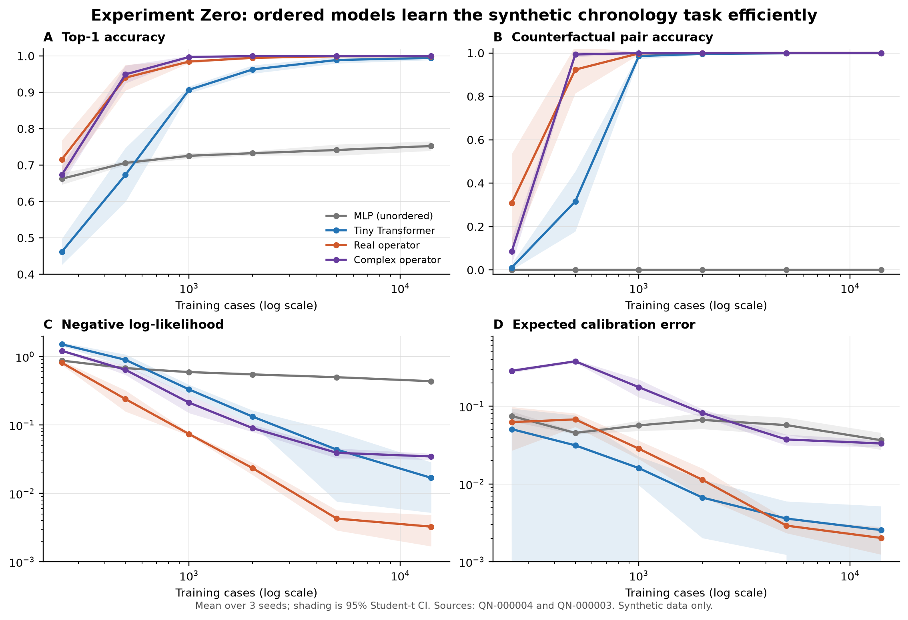

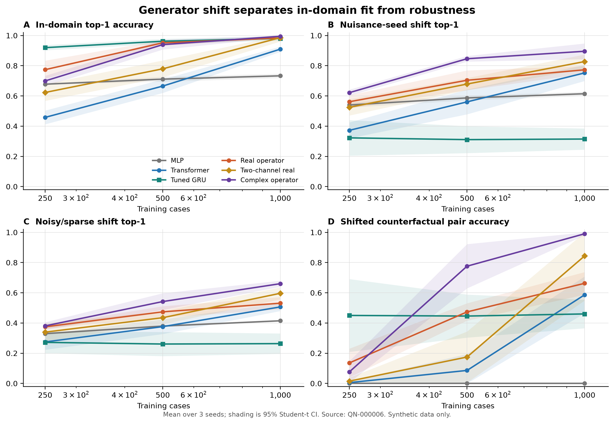

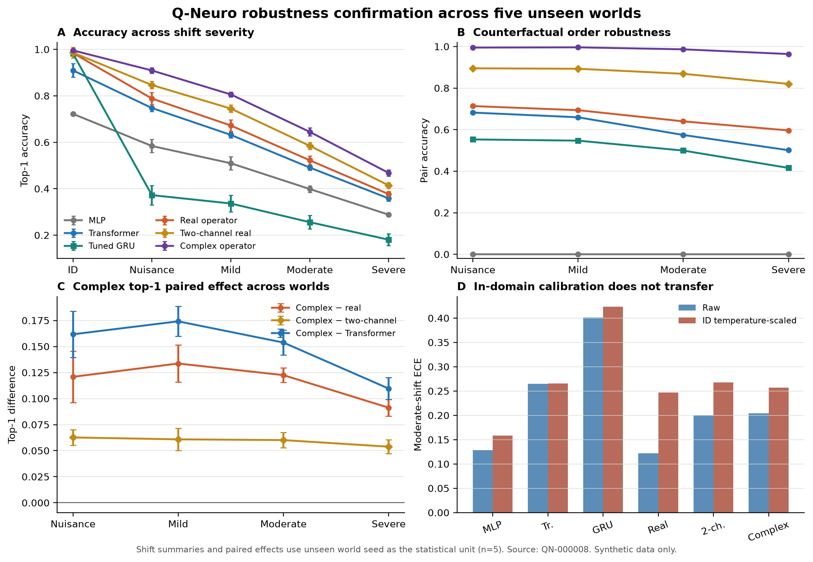

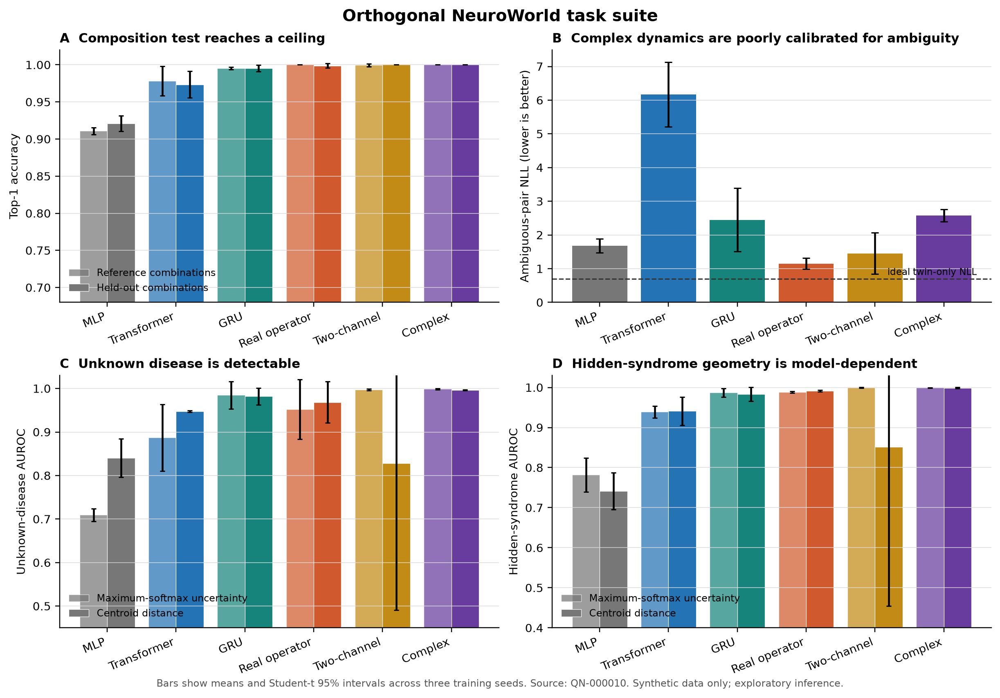

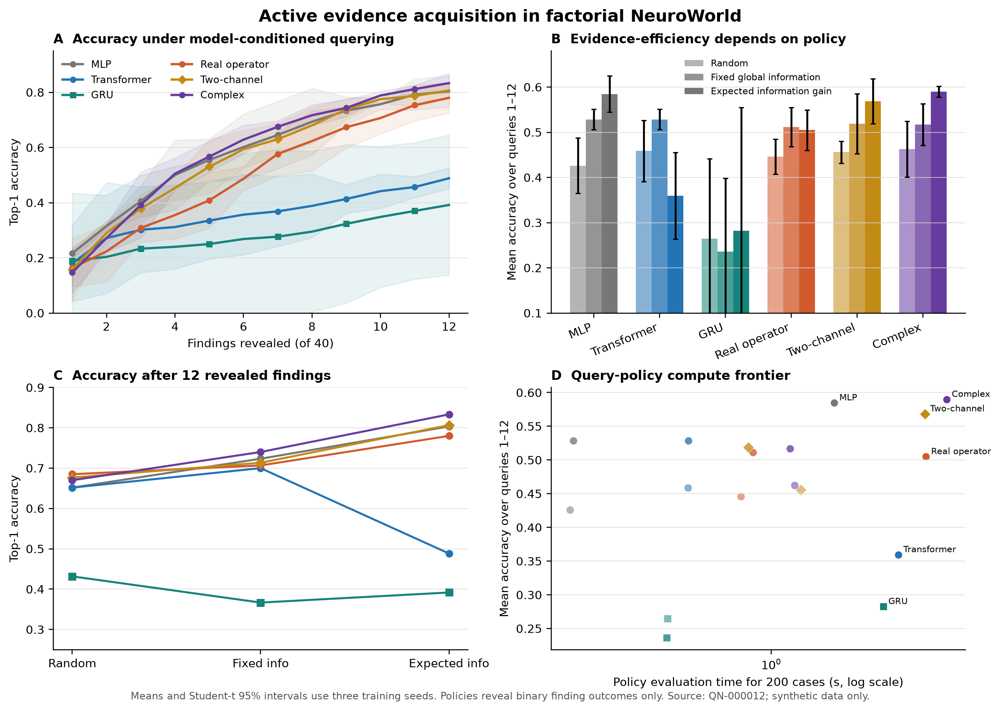

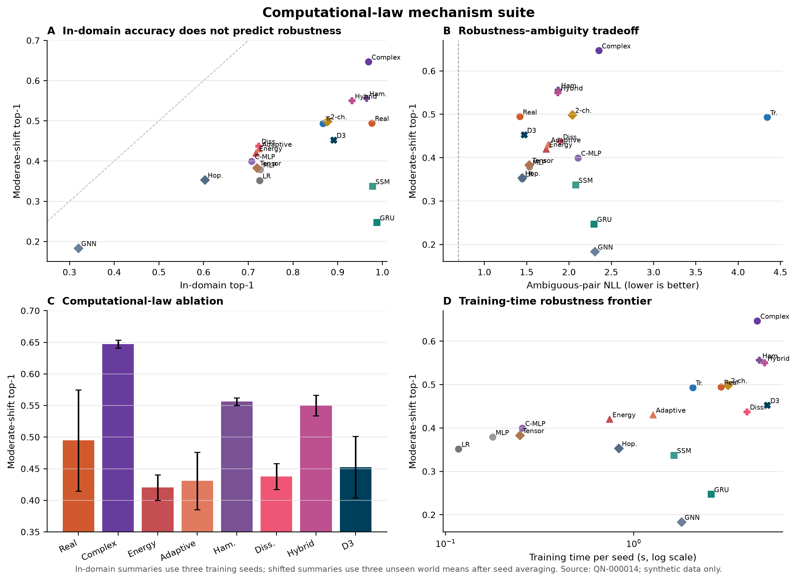

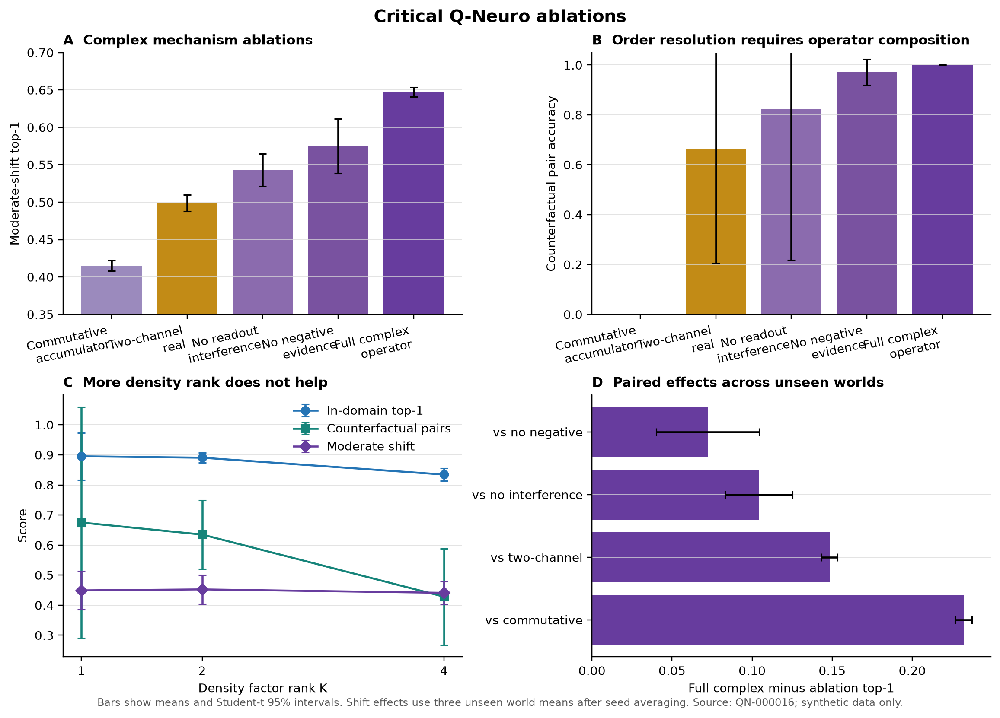

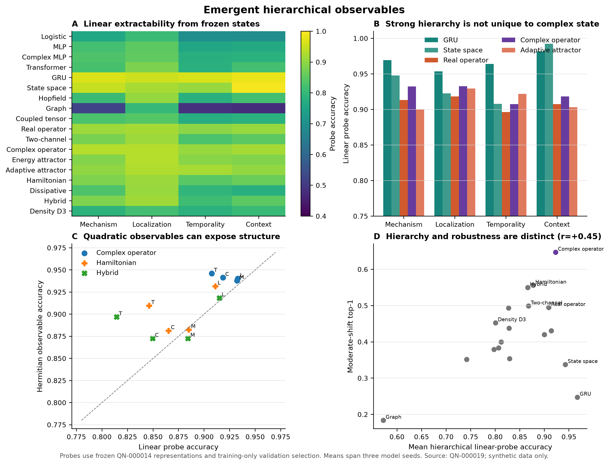

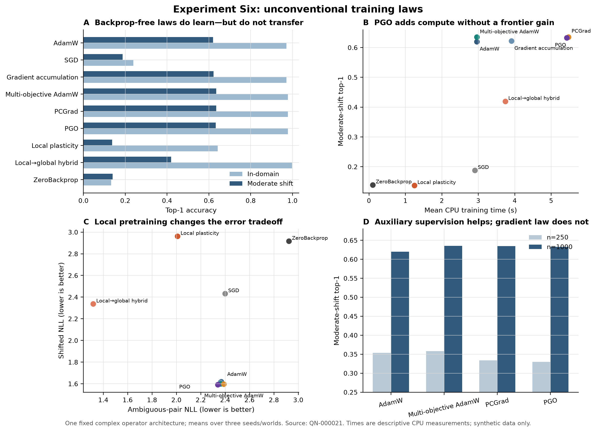

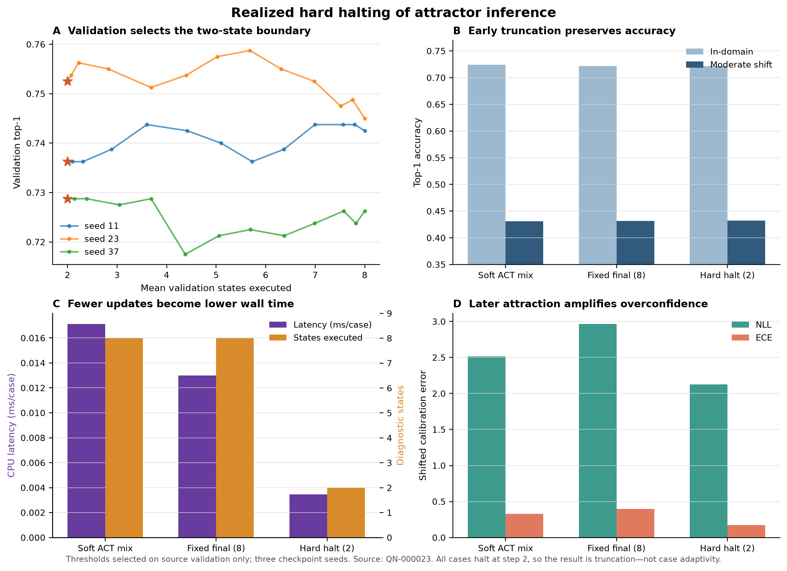

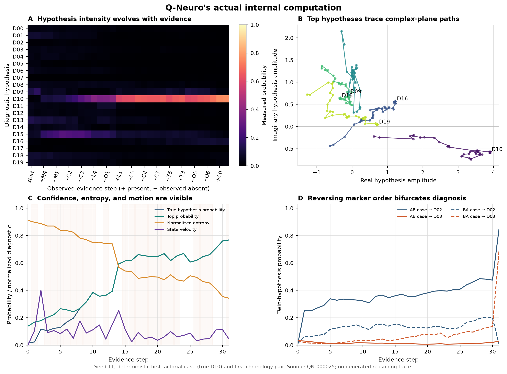

## Quick start

```bash
uv sync --extra dev
uv run python -m pytest
uv run python -m experiments.run_experiment_zero \
  --config experiments/configs/experiment_zero.yaml
# Run the orthogonal task suite after the fast smoke/invariant checks
make neuro-task-suite
make analyses figures
```

Run artifacts are written to a never-overwritten `experiments/results/QN-XXXXXX/` directory and
indexed in `experiments/registry.sqlite3`.

## Research documents

- [`docs/RESEARCH_QUESTIONS.md`](docs/RESEARCH_QUESTIONS.md)
- [`docs/PRIOR_ART.md`](docs/PRIOR_ART.md)
- [`docs/ARCHITECTURE_CANDIDATES.md`](docs/ARCHITECTURE_CANDIDATES.md)
- [`docs/MATHEMATICS.md`](docs/MATHEMATICS.md)
- [`RESULTS.md`](RESULTS.md)
- [`RESEARCH_LOG.md`](RESEARCH_LOG.md)
