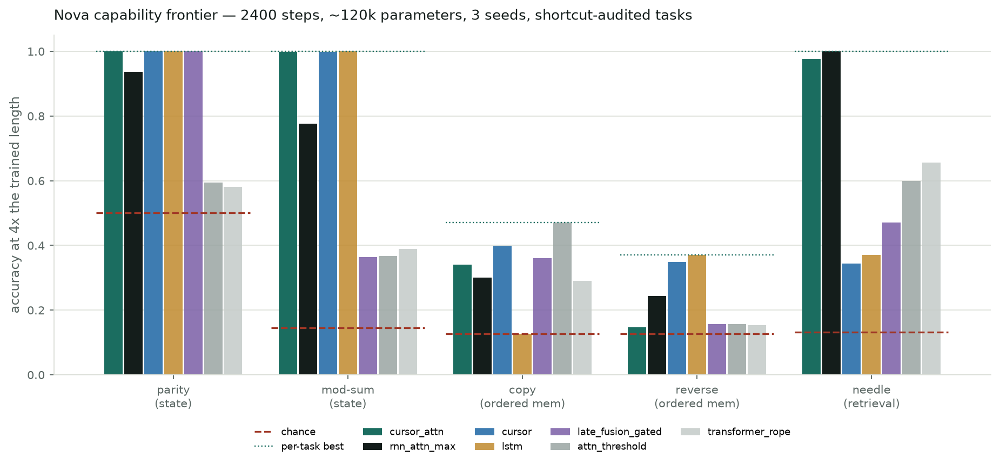
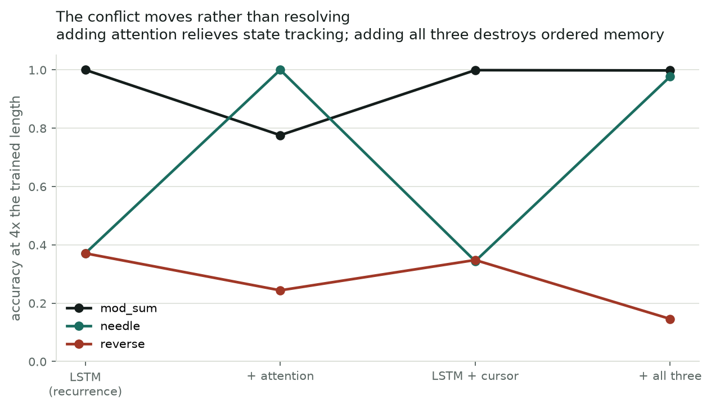

# Equivalence Breaking Under Training: A Falsification-First Study

**Status:** research report. Synthetic, analytic, nonclinical computational work only.
**Date:** 2026-08-16.
**Companion documents:** `docs/TECHNICAL_BREAKDOWN.md` (reproduction), `docs/MONOGRAPH.md` (full narrative including everything that failed).

---

## Abstract

Two neural networks can compute the identical function and still train to different places. We set
out to find the law governing that divergence — a *transport-covariance conjecture* holding that the
discrepancy between equivalent models under training is predictable from a defect measured on the
map relating them. We froze the conjecture, built the machinery to test it, and it **failed**: on
held-out families the best candidate estimator scored a mean out-of-family R² of −31.7, worse than
predicting the mean. Every subsequent attempt to recover a weaker version also failed, across three
further frozen predictions.

What survives is not the law. It is (1) an **equivalence compiler** that forces every claim of
model equivalence to name a level, a domain, and a transport class, and that refuses to certify what
it cannot verify; (2) an exact account of **when equivalence classes contain free directions at
all**, which retroactively explains a string of empirical failures as structurally inevitable;
and (3) a set of **measurement failure modes** — each of which produced a plausible, publishable,
wrong answer before being caught.

We then applied the same discipline to architecture design, over three cycles and **sixteen** frozen
predictions. Cycle 1 closed negative: an adaptive-depth model achieved a real 1.77× inference
saving that reproduced on only 6 of 10 seeds against a baseline that never failed, with a **silent**
failure mode — a broken run still reports a plausible adaptive step count.

Cycle 2 found the cause (an unnormalised recurrent state makes a fixed halting threshold
depth-dependent), removed it, and then attacked what remained. A mechanism was frozen and
**falsified**. A generalisation was frozen and **falsified**. A capability was frozen and
**falsified**. What survived is one scoped engineering result, and it is the **thirteenth**
prediction — the only one in the programme to pass as written:

> On workloads with a deep worst case and heavy-tailed difficulty, halting on a supervised
> predicate attains the *optimal* per-example allocation and delivers a **2.8–4.9× wall-clock**
> inference saving at batch 1, at matched accuracy and matched parameters — and **loses that
> advantage above batch ≈ 32 under lockstep execution**, because a lockstep batch cannot exit until
> its slowest member does.

The ceiling was the load-bearing half, and then it moved. It is analytic for the lockstep policy and
was predicted in advance on one task family and confirmed unprompted on another. But it is a
property of the **runtime**, not of the mechanism: under active-set compaction the same models
recover from 0.97× to **1.95×** at batch 256 on an expensive core — and to only 1.07× on a core
eight times cheaper per step. Two further frozen predictions were opened on the runtime; both
failed, and the second failure is what established that boundary.

Then we tested the mechanism against strong baselines on data we did not design. On UCI Human
Activity Recognition, using the dataset's own subject-disjoint split, **it came fourth of five**:
ACT (2016) reached 0.9006 accuracy using 3.61 of 16 chunks and confidence-based early exit reached
0.8747 at matched compute, while supervised halting reached 0.8112 — at 2.3× the training cost,
because real data supplies no halt target and one must be distilled from a teacher.

That is the programme's headline, and it is a scope condition:

> **Supervised halting earns its place only where the task supplies a ground-truth halt step.**
> Where it does, the mechanism attains optimal allocation at matched accuracy with 10/10 seed
> reliability. Where it does not, simpler methods that need no teacher win.

We claim no state-of-the-art result, **no new mechanism, and no new architecture**. What survives is
a set of measured boundaries and the falsification discipline that produced them.

---

## 1. The problem

Reparameterize a trained network — permute its hidden units, rescale a layer and inverse-scale the
next, factorize a dense matrix — and the function is unchanged. Start training from the two
descriptions and they do not stay together. The optimizer sees coordinates, not functions.

This is not a curiosity. It is why an "architecture improvement" can be an artifact of coordinates,
why an ablation can measure the parameterization rather than the mechanism, and why two teams
implementing the same idea report different numbers. Anything you would want to say about
architecture rests on knowing which differences are real.

The natural conjecture is that the divergence is *predictable*: that if you can measure how badly a
map fails to commute with the optimizer, you can predict how far apart the two models end up. We
call this the **transport-covariance conjecture**. It is the thing this program was built to test.

## 2. The principle

The organizing idea is a negative one, and it is the most load-bearing thing here:

> **Equivalence is not a property of two models. It is a property of a map, at a stated level,
> on a stated domain, with a stated transport class.**

"These two models are equivalent" is not a well-formed claim. Four questions have to be answered
before it means anything:

- **Which map** carries one to the other?
- **At what level** does it hold — symbolically, in exact finite-precision arithmetic, under
  adversarial probing, distributionally, or only in aggregate metrics?
- **On what domain** — everywhere, or with a region excluded?
- **What transports** — the parameters only, or the gradients, the optimizer state, the learning
  rate, the weight decay?

Almost every informal equivalence claim in practice answers none of these, and the answers turn out
to matter enormously. Two maps that are both "exact" can behave completely differently under
training, because one transports optimizer state and the other cannot.

## 3. The theory

### 3.1 Two ladders

**Equivalence levels**, strongest first:

| Level | Meaning |
|---|---|
| **E0** | Symbolic identity of the computed function |
| **E1** | Bit-exact agreement in finite precision |
| **E2** | Survives an adversarial audit suite on a declared domain |
| **E3** | Distributional agreement |
| **E4** | Agreement in aggregate metrics only |

**Transport levels** T0–T5 grade what the map carries: T0 parameters only; higher levels add
gradients, optimizer moments, the learning-rate policy, and weight decay.

The two ladders are independent, and their product is where the interesting failures live. E0 with
T0 is common and nearly useless: the models are the same function and will still diverge on the
first step. E2 with T5 is rare and strong.

### 3.2 Certificates that can refuse

The compiler emits a certificate naming level, domain, and transport class. Three refusals are
enforced in code rather than in prose:

- Declaring **E0 or E1 together with a domain restriction** is a construction-time error. A map
  that needs a region excluded is not globally exact, and the type system says so.
- A certificate may be **downgraded, never upgraded**. Attempting to strengthen one raises.
- A map that cannot transport gradients **says so** (`supports_optimizer_transport = False`) and
  refuses rather than approximating. The dense/factorized map is the canonical case: factor descent
  preconditions the product, so no gradient transport exists, and the framework declines to invent
  one.

This is the part we would defend hardest. It is unglamorous and it caught real errors.

### 3.3 Transport-degeneracy

A pair is **transport-degenerate** when the parameter map is the identity on shared coordinates.
Then every transport level is vacuously satisfied and the pair can tell you nothing about transport.

This sounds pedantic. It invalidated our own earlier result. The complex-versus-real comparison that
motivated the program used an "exact real" control that shared coordinates with the complex model;
the entire transport story was vacuous by construction, and the measured 5.245e-06 forward
discrepancy was numerical implementation, not equivalence breaking (`docs/EQUIVALENCE_SCIENCE_AMENDMENT_001.md`).

### 3.4 The dimension law

Let `P` be the parameter count, `g_arch` the dimension of the architecture's exact
function-preserving symmetry group, `n` the number of training points, and `C` the class count.
The first-order subspace of directions preserving all training predictions while able to change
predictions elsewhere has dimension

```
d_free = max(0, P − g_arch − n(C−1))
```

`g_arch` has two identified components: softmax common-mode invariance contributes `h_last + 1`,
independent of the class count; and each positively homogeneous hidden layer contributes `h` more,
because `(W₁, W₂) → (cW₁, W₂/c)` is then an exact symmetry.

This is rank-nullity plus a correct symmetry count. **No novelty is claimed** — ReLU scaling
symmetry and softmax shift invariance are textbook. Its value is diagnostic, and it is stated here
because it is the explanation for §5.

## 4. What was frozen, and what happened when it was opened

Every prediction below was serialized and SHA-256 hashed **before** the evidence existed. Hashes are
verified at load time; the test code reads its thresholds from the frozen record so it cannot drift
from the prediction it is testing.

| Prediction | Claim | Attempts | Verdict |
|---|---|---|---|
| Gate D (`QE-000009`) | A defect estimator beats every baseline on ≥2 held-out families | 1 | **FAIL** — won 1 family |
| `DISCOVERY-001-P1` | `ρ = ηλ_max/2 > 1 ⟹ divergence`, nonlinear | 1 | **VACUOUS** — grid never reached ρ ≥ 1.1 |
| `DISCOVERY-001-P2` | same, with ρ placed by construction | 1 | **FAIL** — 96 of 96 cells at ρ ≥ 1.1 converged |
| `DFREE-LAW-P1` | `g = h_last+1` universally | 1 | **COMPROMISED** — substance held 126/126 but the instrument was changed after seeing failure |
| `DFREE-LAW-P2` | same, untouched grid, full protocol | 1 | **FAIL** — 118 of 360 |
| `DFREE-LAW-P3` | `g = (h_last+1) + h·[homogeneous]` | 1 | **FAIL** — 2 of 48 |
| `QNEURO3-Q3-P1` | adaptive-depth saving = `max_depth / E[distance]` | 1 | **FAIL** — 3 of 4 distributions |
| `QNEURO3-Q4-P1` | position grounding repairs seed reliability | 1 | **FAIL** — kill condition triggered |
| `QNEURO3-ATTRIB-P1` | carry distance explains the readout separation | 1 | **FAIL** — profile flat, kill triggered |
| `QNEURO3-TRANSFER-P1` | the separation generalises to a new family | 1 | **FAIL** — kill triggered; T3 passed |
| `QNEURO3-EXTRAP-P1` | predicate halting buys depth extrapolation | 1 | **FAIL** — all three, kill triggered |
| `QNEURO3-PARETO-P1` | the saving scales to depth 32 | 1 | **FAIL** — R2 passed, R1 and R3 did not |
| `QNEURO3-NICHE-P1` | the small-batch win **and its ceiling** transfer | 1 | **PASS** — all four |

Thirteen frozen predictions. **One passed as written**, and it is the last one, after twelve
failures narrowed the claim to something small enough to be true. Two contained genuine prospective successes inside failures. `DFREE-LAW-P3`: `leaky_relu` and `abs`
were derived as positively homogeneous before measurement and gave exactly `2h+1` in every cell —
but two ELU cells at `h=15` measured 17 against a predicted 16, and the frozen criterion was
exactness. `QNEURO3-TRANSFER-P1`: its third clause, that halting is free, passed on an untouched
family while the two clauses that mattered to the hypothesis failed.

We report that record as the primary result of the program.

## 5. Mechanism: why the law failed

Two mechanisms account for essentially all of it, and both were identified *after* the failures and
then checked.

### 5.1 The families straddle a phase boundary

Gate D's failure mode is **calibration, not absence of signal**. Within a family, the
`cumulative_defect` estimator is the strongest feature available and beats every baseline (R² 0.962
on factorization, 0.812 on the scaling orbit). Across families it collapses to −31.7, because family
medians span about **6.5 orders of magnitude** — permutation sits near 1e-7 because its map is
conjugate and there is nothing left to predict, while the scaling orbit sits near 1e-0.6. The ranges
chain rather than clustering, so a single global slope and intercept is the wrong object.

Why do they span that range? Because reparameterization moves the effective step size. Under uniform
scale `s` with an untransported learning rate, the target's update operator is `I − (η/s²)H`, so its
effective step is `η/s²` and it is stable exactly when `ρ = ηλ_max(H)/(2s²) < 1`. For `s < 1` there
is an open window where a model converges and its **exact equivalent diverges**. We measured this:
across a 1.4% change in `s`, paired divergence moves ~14 orders of magnitude, with 0 false alarms in
1,476 SGD cells and prediction accuracy 0.9912. The differential prediction confirms the mechanism —
Adam's update is scale-free in the gradient, so the boundary should be absent, and it is: 1 divergent
cell out of 1,476 against 720 for SGD.

The discovery families sit on opposite sides of that boundary. They are not one population, so no
single calibration can span them.

### 5.2 Initialization curvature does not govern a nonlinear trajectory

The stability boundary is exact for quadratic objectives and **fails completely** for nonlinear ones.
`DISCOVERY-001-P2` put 96 cells at `ρ ≥ 1.1` and all 96 converged; the SGD divergence rate was 0.0000
even at `ρ = 3.0`, with growth ratios of 1.03–1.27 against a threshold of 2.0.

This was the failure mode written into P2's `anticipated_failure_modes` before the run. `ρ` is
computed from the Hessian at initialization, but a ReLU network under cross-entropy relocates to
flatter regions and the loss saturates, so an initially over-large step does not compound. The defect
is not calibration. It is that one initialization-time curvature does not govern a nonlinear
trajectory — and the surviving half, `ρ < 1 ⟹ stable`, has produced zero counterexamples across 269
scored cells.

### 5.3 Why the free directions were never there

Seven consecutive attempts to navigate the near-optimal set — find directions that preserve training
behavior while improving out-of-distribution behavior — failed. The dimension law explains all of
them at once: those searches ran at `n = 600` with `P − g = 193`, so `d_free = 0` **exactly**. There
was no subspace to find. The searches were structurally doomed, not unlucky.

Stated before measurement and then confirmed exactly in 9 of 9 cells, including the predicted
transition at `n = 193`:

| n | 50 | 100 | 150 | 180 | 190 | 193 | 200 | 250 | 400 |
|---|---:|---:|---:|---:|---:|---:|---:|---:|---:|
| predicted | 143 | 93 | 43 | 13 | 3 | 0 | 0 | 0 | 0 |
| measured | 143 | 93 | 43 | 13 | 3 | 0 | 0 | 0 | 0 |

Three reusable controls come out of this: check `d_free` before searching for free directions; check
integrability before trusting a first-order subspace; check whether the simplest use of the same
information already dominates. On the last point — joint training on the combined data beat every
navigation method on all four measured axes.

## 6. Q-Neuro 3.0: the same discipline applied to architecture

Cycle 1 asked whether a model that decides its own depth can beat a fixed-depth model when the
required depth genuinely varies per example and is discoverable only by working.

**Task.** `chase_to_goal`: a permutation defines a single cycle through 24 nodes; the model starts
somewhere on it and reports how many hops away node 0 is, up to 8. Nothing in the input announces the
answer. Guessing gives 0.136.

**Results**, matched on parameters, data, training budget and wall-clock:

| Model | Mechanism | Params | Accuracy | Steps | Reliable seeds |
|---|---|---:|---|---:|---|
| Q0 | fixed depth 8 | 28,360 | 1.0000 | 8.00 | **10 / 10** |
| Q1 | PonderNet-style mixture halting | 28,425 | 0.6241 | 3.27 | — |
| Q2 | hard commit, straight-through | 28,425 | 0.9999 | 8.00 | — |
| Q3 | halt on detected arrival | **27,970** | 0.9994–1.0000 | **4.54** | **6 / 10** |
| Q4 | Q3 + training-only position grounding | 27,970 | 0.6322–0.9500 | 4.50–5.33 | 0 / 10 |

Three findings, in decreasing order of how much we like them.

**Mixture halting collapses where commit halting does not.** Q1 caps at 0.6241; changing only the
halting rule to a hard straight-through commit lifts the same core to 0.9999. Single-variable
intervention, seed held fixed.

**The 1.77× is real and is not reportable.** Q3's saving is genuine on the seeds where it trains, and
reproduces to within 0.0006 accuracy and 0.00 steps on seeds 0, 2 and 3. But the outcome is
**bimodal**: every run lands either at 0.9994–1.0000 with 4.54 steps or at 0.42–0.57 with 5.2–6.1
steps, and nothing lands in between. Training volume changes nothing; seed decides. Q0 under identical
conditions is 10 of 10 with a minimum of 0.9919, so the unreliability belongs to the architecture.
Expected accuracy across seeds: **0.78 for Q3 against 1.00 for Q0.**

**The failure mode is silent and mimics success.** A collapsed Q3 run reports 5.2–6.1 average steps —
a plausible, non-degenerate, adaptive-looking allocation, comfortably below the fixed depth of 8. Read
the step counter alone and all thirteen failed runs look like working elastic models delivering a
1.3–1.5× saving. Only the accuracy column reveals the model is wrong more than half the time.

We consider this the most portable result in the section. **Any adaptive-compute system whose
halting signal is also its answer can fail this way**, and a compute-saving figure reported without a
matched accuracy figure and a matched seed-reliability rate cannot distinguish a working elastic model
from a broken one.

The attempted repair failed instructively. `QNEURO3-Q4-P1` was frozen before its code was written:
supply the missing positional representation at zero inference cost and reliability should reach
≥9/10. Result: 0 of 10, kill condition triggered as written. It removed the collapse mode — no run
below 0.6322 — and removed the good mode with it, best run 0.9500. Reducing seed variance destroyed
the solution worth having.

## 7. Cycle 2: the cause, and the one result that survived

### 7.1 The cause of the bimodality

Diagnosing Q3 by accuracy *conditioned on distance* settled it in one measurement: failing runs are
perfect at distances 1–2 and collapse from 3 onward (0.34, 0.12, 0.03, 0.01). The recurrent state
stops carrying position. **RMS-normalising the state after each hop** took the variant sweep from
11 of 24 seeds to **6 of 6**, every success landing on exactly 1.0000 at 4.54 steps. Three other
single-variable interventions run alongside did not help: a goal-match feature (3/6), dense per-step
halting supervision (3/6), both (2/6).

Layer normalisation in recurrent networks is textbook and no novelty is claimed. Two things about it
here are worth recording. It is an *interaction*, not a main effect — normalisation **destroys** the
fixed-depth model on the same task (1.0000 → 0.13–0.25), because an unnormalised residual state
carries magnitude information the distance readout depends on. And §7.4 shows it costs 0.30 of
extrapolated accuracy on a different family, so the final architecture exposes it as a flag.

### 7.2 A separation, and three ways it failed to become a principle

With a reliable model, the control that cycle 1 left open became runnable: decouple the answer from
the step count. On a content-addressed lookup task — walk to the first node whose label matches a
query, report *which node* — the readout location decides everything:

| Model | Answer read from | Steps | Answer acc | Step-id acc |
|---|---|---:|---|---|
| fixed | final state | 8.00 | 0.221–0.223 | — |
| fixed, 3× training | final state | 8.00 | 0.256–0.273 | — |
| fixed_supervised | final state + per-step loss | 8.00 | 0.232–0.243 | 0.13–0.31 |
| gated | final state + explicit latch | 8.00 | 0.222–0.239 | 0.16–0.18 |
| mean_pooled | mean of all states | 8.00 | 0.259–**0.847** | 0.16–0.86 |
| **select** | **input-selected step** | 8.00 | **1.0000** | **1.0000** |
| **arrival** | **first step the predicate fires** | **4.45** | **1.0000** | **1.0000** |

Chance is 0.042; guessing any node carrying the query label gives 0.291. Five distinct fixed-depth
alternatives fail — including with supervision matched and an explicit latch — where input-selected
readout succeeds on every seed.

Then it was frozen three times and falsified three times.

**The mechanism was false.** `QNEURO3-ATTRIB-P1` said the fixed model degrades in proportion to how
far it must carry a match. Accuracy by distance is **flat at ~0.22**; the required margin was 0.30
and measured 0.02 and 0.07. It fails uniformly, including where nothing is carried.

**It did not generalise.** `QNEURO3-TRANSFER-P1` opened an untouched family — streaming
threshold-crossing, no attention anywhere in the core. Required: final-state readout ≥0.20 below
selection. Measured: **0.9351 against 0.9425**, a gap of 0.007. Scoped to associative-lookup tasks;
no principle claimed. The best model on the new family is the *explicit latch* (0.9760), one of the
controls that failed on lookup — **the two families reward opposite designs.**

**It buys no capability.** `QNEURO3-EXTRAP-P1` tested the one thing halting could uniquely offer:
running past the trained depth, since its stopping rule is local rather than a count. Trained at 12,
evaluated at 16: 0.8328 / 0.3528 / 0.6548 against a required 0.80 on every seed. And it *inverted* —
the **unnormalised** model extrapolates at 0.9136 against the normalised 0.6135.

### 7.3 What survived, and its ceiling

One clause survived, and it had already transferred prospectively as T3 of a prediction that
otherwise failed: **halting on a supervised predicate costs nothing in accuracy and returns the
workload's full compute saving.** Mean steps track `E[predicate index]` to within 0.1 across six
settings — 4.45/8, 6.55/12, 2.51/4, 4.54/8, 6.60/12, 6.14/24. That is *optimal* allocation, which
also means the size of the saving belongs to the workload.

The first attempt to bank it failed usefully. `QNEURO3-PARETO-P1` measured batched latency and found
**1.0×** despite a 6.5× step-count saving: the batched forward runs every step and *then* selects, so
the saving was nominal. Implementing genuine early exit exposed the real structure:

> A batch cannot exit until its slowest member does, so batched cost tracks `E[max halt over the
> batch]`, not `E[halt]`.

That is arithmetic, not implementation. For `P(k) ∝ 0.8^k` on 1..32 it gives E[max] = 4.97 at
batch 1, 12.53 at 8, 20.96 at 64, 29.42 at 1024 — the realisable saving decaying from 6.43× to
1.09×. It applies to ACT, PonderNet, early-exit transformers and depth-routed mixtures alike.

### 7.4 The one prediction that passed

`QNEURO3-NICHE-P1` was frozen on the streaming family's measurements and opened, once, on the
associative-lookup family at depth 24 with a heavy-tailed difficulty distribution never used before.
All four clauses hold:

| Clause | Required | Measured |
|---|---|---|
| N1 accuracy matched | within 0.02 of `select` | 1.0000 vs 1.0000 |
| N2 optimal allocation | steps within 0.5 of E[d] | 6.14 vs E[d] 6.14 |
| N3 small-batch win | ≥2.5× at batch 1 | **2.78×** |
| N4 **the ceiling reappears** | ≤1.2× at batch 256 | **0.97×** |

The measured crossover, on a family it was not derived from: 2.99× at batch 1, 1.58× at 4, 1.18× at
16, 0.99× at 64, 0.97× at 256.

**N4 is the clause that matters.** A result that only predicts its own success is weak; this one
predicted where it stops working, on evidence it had not seen, and was right.

### 7.5 The ceiling was a runtime property, and it moves

The confirmed ceiling licensed a claim about *lockstep* execution and nothing wider. Stated
correctly: **heterogeneous halt depths create a straggler effect under lockstep batching**, so
per-example savings translate strongly into low-batch latency and can vanish at large batch. The
per-example FLOP saving is untouched; what changes is whether the execution policy realises it.

The prior art here is unambiguous and no novelty is claimed for any of it: active-set compaction is
the standard early-exit loop and is what MoE dispatch does per layer; continuous batching is
iteration-level scheduling as deployed in LLM serving; length bucketing predates transformers
(`docs/PRIOR_ART_RUNTIME.md`). All four were implemented as baselines, and every one is verified to
reproduce lockstep's answers exactly.

**Compaction recovers the waste — conditionally.** On the associative-lookup family, against the
same matched-accuracy full-depth baseline:

| batch | lockstep vs baseline | **compacted vs baseline** |
|---:|---:|---:|
| 1 | 3.64× | 3.27× |
| 16 | 1.04× | **1.28×** |
| 64 | 1.10× | **1.59×** |
| 256 | 1.01× | **1.95×** |

The advantage stops decaying and starts *growing* with batch size. Two frozen predictions were
opened on this and both failed:

- **`QNEURO3-RUNTIME-P1`** froze a cost model `T = c_step·rows + c_launch·iters + c_compact·compactions`
  and predicted the crossover at batch 45. Measured: the crossover is below 16. The model is accurate
  where compute dominates (1.0% error at batch 128) and badly wrong where overhead does (55% at
  batch 16). Kill condition applied — **no predictive runtime equation is claimed.**
- **`QNEURO3-RUNTIME-P2`** predicted the recovery would transfer to the streaming family.
  It does not: 1.065× against a required 1.5×. The reason was written into the anticipated failure
  modes before the run — at 0.33 µs per example-step, a removed row saves less than the gather costs.

So the boundary is: **compaction removes the straggler ceiling when per-step cost is large relative
to gather cost.** Measured at 2.66 µs/example-step it works (1.95×); at 0.33 µs/example-step it does
not (1.07×). A second boundary, of exactly the same shape as the first — the advantage is real, and
every stronger control finds it bounded by something that is not the mechanism.

### 7.6 Real data, strong baselines, and the scope condition

Everything above is on synthetic tasks we designed. The last phase tested the mechanism where we
had no control over the data and against the strongest directly relevant methods.

**Setting.** UCI Human Activity Recognition: 9 inertial channels × 128 timesteps, 6 classes,
delivered in 16 chunks of 8. Early classification — emit the activity as soon as possible. The split
is the dataset's own canonical subject-disjoint partition (17 train / 4 validation / 9 test
subjects), so it is a genuine distribution shift by person and we did not choose it. Protocol frozen
and hashed before the test subjects were read.

**Five arms, one core, identical parameter counts (63,271), three seeds:**

| arm | test accuracy | mean chunks | p95 chunks | train s |
|---|---:|---:|---:|---:|
| fixed depth | **0.9127** | 16.00 | 16.00 | 3.6 |
| **ACT** (Graves 2016) | **0.9006** | **3.61** | 10.33 | 4.5 |
| confidence exit | 0.8811 | 2.57 | 13.00 | 3.4 |
| confidence exit @ matched compute | 0.8747 | 2.28 | 10.00 | 3.4 |
| **supervised halting (ours)** | 0.8112 | 2.39 | 15.67 | **8.4** |
| PonderNet | 0.5220 | 16.00 | 16.00 | 4.3 |

`QNEURO3-HAR-P1` required our arm to be within 0.02 of fixed depth (H1) and at least equal to
confidence exit at matched compute (H3). Both failed. **The kill condition applied.**

Real data supplies no ground-truth halt step, so ours had to be distilled from a teacher's earliest
confident-correct chunk — early-exit distillation, declared as prior art in the frozen record
beforehand, and the reason our arm costs 2.3× the training time.

*What did transfer* is the runtime characterisation, completely: 6.38× at batch 1, 0.70× at batch
256 under lockstep, 1.63× under compaction. The execution-policy findings hold on real data even
though the mechanism does not win.

PonderNet's collapse is very likely our implementation's fault rather than the method's; ACT working
well on the same core suggests the harness is fair, and a correct PonderNet would only rank above
us.

### 7.7 Three architecture branches, three controls, three deaths

- **Complex fields.** A genuinely complex state with Hermitian attention, at matched *real*
  parameter count: 1.0000 accuracy, 1.0000 halting, 6.15 mean steps on 3/3 seeds — identical to the
  real control. Expressivity was already known identical by exact realification; optimisation
  outcome is now measured identical too.
- **Adaptive width.** Two-axis allocation `C(x) = T(x)·N(x)` with a per-step router over hidden
  groups reaches 1.0000 at cost 3.07 — and a **statically narrow** model matches it at the same cost
  with 43% fewer parameters, while static 2/8 reaches 1.0000 at cost 1.54 where routed 2/8 manages
  only 0.8143. At binding capacity routing is strictly worse. Killed by its own control.
- **Homeostasis, self-repair, developmental specialisation, distillation.** Recorded as **not
  attempted**, with reasons, rather than as negative results.

### 7.8 Reliability, and the M2 frontier

On the family where the mechanism works, reliability is not the weak point: **10 of 10 seeds at
1.0000 accuracy *and* 1.0000 halt accuracy**, zero catastrophic runs, expected calibration error
0.0018–0.0021, and 9 of 12 hyperparameter configurations perfect — all three failures at a single
under-trained learning rate.

Full M2 sweep, matched accuracy, microseconds per example (median):

| batch | select | lockstep | compacted | best speedup | rows/example |
|---:|---:|---:|---:|---:|---:|
| 1 | 1504.4 | **417.5** | 469.2 | 3.60× | 5.0 vs 24 |
| 8 | 374.7 | 361.0 | **331.0** | 1.13× | 6.5 vs 24 |
| 32 | 180.9 | 162.4 | **124.9** | 1.45× | 5.2 vs 24 |
| 256 | 72.1 | 71.9 | **38.7** | **1.86×** | 5.5 vs 24 |

Throughput at batch 256 rises from 13,872/s to 25,841/s, and analytic peak activation memory falls
from 1,536 KiB to 457 KiB — a 3.4× reduction, a second Pareto axis. The planner selects the
measured-optimal policy at 8 of 9 batch sizes (it is conservative at batch 8, where compaction
already wins by 1.09×).

### 7.9 The final architecture

`qneuro3/adaptive.py`. Every component carries the measurement that justifies it: a first-arrival
objective (mixture halting caps at 0.6241 where this reaches 1.0000; commit halting reaches 0.9999
but only at full depth); the answer read at the halt step; an optional normalised state (a flag, per
§7.2 and §7.4); and genuine early exit (without it the saving measures 1.0×). The M2 modes are not
presets — each is the regime where a measurement says something different is correct:

| Mode | Regime | Policy |
|---|---|---|
| **M2 Eco** | batch 1 | lockstep early exit; nothing to compact |
| **M2 Balanced** | batch < 32, cheap steps | lockstep early exit |
| **M2 Throughput+** | batch ≥ 16 and ≥1 µs/example-step | **active-set compaction** — measured 1.28–1.95× |
| **M2 Throughput** | batch ≥ 32 with cheap steps | full depth + select; early exit is a measured penalty |

## 8. Compute accounting

All experiments ran on one fanless Apple M2 MacBook Air: 8.0 GiB unified memory (2.08 GiB available),
8 physical cores, 4 torch threads, MPS with `complex64` support, measured CPU↔MPS crossover at 65,536
elements, working budget 1.04 GiB at a deliberately conservative 50% of available memory — sustained
swapping on a fanless machine costs more than a smaller model does.

No experiment in this program required more. Q3 trains in 28.8 s. The largest sweeps are the Gate C
grid (405 cells, 360 scored) and the DISCOVERY-001 sweep (1,476 SGD cells). This is a deliberate
property of the design: microcosms small enough that the ground truth is computable are worth more
than scale, when the question is whether a claim is true.

## 9. What we claim, and what we do not

**We claim:**

1. The transport-covariance conjecture, as stated, is **false** at the level of a single global
   calibration across equivalence families, and we have identified the mechanism.
2. Equivalence claims are only meaningful with a level, a domain, and a transport class attached, and
   this can be enforced mechanically.
3. `d_free = max(0, P − g_arch − n(C−1))` predicted a rank transition exactly, and explains a string
   of prior failures.
4. On `chase_to_goal`, adaptive depth loses to fixed depth once reliability is counted alongside
   compute — and the reason is an unnormalised state, which is fixable.
5. **Halting on a supervised predicate attains the optimal per-example allocation** — mean steps
   equal `E[predicate index]` to within 0.1 across six settings — and delivers a 2.8–4.9× wall-clock
   inference saving at batch 1 at matched accuracy and parameters.
6. **That advantage has an analytic ceiling under lockstep execution.** Lockstep cost tracks
   `E[max halt over the batch]`, so the saving decays to parity by batch ≈ 32. Predicted on one task
   family, confirmed unprompted on another.
7. **The ceiling belongs to the runtime, not the mechanism, and is conditionally removable.**
   Active-set compaction — prior art — restores the advantage from 0.97× to 1.95× at batch 256 when
   per-step cost is ≳1 µs, and does not when it is ≲0.33 µs.
8. **The mechanism earns its place only where the task supplies a halt target.** On real data
   without one, ACT and confidence-based early exit both beat it at matched compute, and it costs
   2.3× the training time.

**We do not claim:** any state-of-the-art result; **any new mechanism or new architecture**; any
novelty for predicate halting, per-step attribution, state normalisation, compaction, continuous
batching, bucketing, width routing or complex fields, all of which are prior art; that the readout-location separation
generalises (it was frozen and falsified); that adaptive halting buys any capability such as depth
extrapolation (frozen and falsified); that the transport conjecture is false in every possible form;
any clinical validity; any connection to quantum cognition; or that any method here is generally
superior to any other.

**Open, and stated as open:** why the fixed-depth readout has a sharp capability threshold between
depth 4 and depth 8 on lookup tasks (the frozen carry-distance explanation is false); why two task
constructions inducing the same distance distribution give 6/10 versus 1/10 success; a correct
predictive cost model for the compaction crossover (the first attempt failed and was not patched);
whether the result transports to a second hardware regime (no second machine was available, recorded
as future validation); and non-vacuity of the transport bound in the nonlinear setting.

## 10. Nova: the search for a new computational principle

The programme's final era started from a clean architectural slate and asked whether a genuinely new
principle of neural computation could be found. The answer is no, and the search is worth reporting
because of how it failed.

### 10.1 The instrument

Eight algorithmic tasks with known optimal procedures, each evaluated at the trained length and at
2× and 4× beyond it. Length extrapolation is the axis because it is a *systematic* failure of the
dominant architectures, not a tuning matter: a model either implements the procedure or it fitted
the training lengths.

**A shortcut audit disqualified two of our own tasks before any candidate was compared.**
Position-only prediction scores 0.887 on `cummax` and 0.598 on `sort` at length 64. Both were
dropped from headline scoring. Five remain, with degenerate-predictor ceilings within 0.03 of chance.

### 10.2 The frontier

Thirty-two architectures across six mechanism families, matched at ~120k parameters and 2400
optimiser steps, three seeds, evaluated at 4× the trained length:

| architecture | parity | mod-sum | copy | reverse | needle | mean |
|---|---:|---:|---:|---:|---:|---:|
| **cursor_attn** | 1.000 | 0.998 | 0.340 | **0.146** | 0.977 | **0.692** |
| rnn_attn_max | 0.937 | 0.776 | 0.301 | 0.244 | **1.000** | 0.652 |
| cursor | **1.000** | 0.999 | **0.398** | 0.348 | 0.344 | 0.618 |
| LSTM | **1.000** | **1.000** | 0.126 | **0.371** | 0.371 | 0.574 |
| attn_threshold | 0.594 | 0.367 | **0.470** | 0.157 | 0.600 | 0.438 |
| transformer (RoPE) | 0.580 | 0.389 | 0.291 | 0.153 | 0.656 | 0.414 |
| *chance* | *0.501* | *0.145* | *0.126* | *0.126* | *0.131* | — |



### 10.3 What the search found

**No new mechanism.** The two leading architectures are prior-art compositions: `rnn_attn_max` is an
attention-augmented recurrent network (Bahdanau et al. 2014), and `cursor` reproduces Neural Turing
Machine location-based addressing (Graves et al. 2014) — more weakly than the original, on the task
the NTM paper introduced it for. `docs/NOVA_PRIOR_ART.md` gives the equation-level comparison.

**Three frozen hypotheses, three falsifications.**

- *H-DILUTION* — softmax attention is not length-invariant, so a read whose output ignores
  non-matching keys should extrapolate better. The operator-level property is real (read drift 0.236
  vs softmax's 0.724), and the task-level effect is entirely captured by a confound control: giving
  softmax the same post-read normalisation moves copy from 0.172 to 0.305. Two implementation bugs
  were found first, one of which made the candidate algebraically identical to the control.
- *H-INTERFERENCE* — handicapping the non-extrapolating route should let the extrapolating one be
  learned. All four clauses failed. Dropout does not de-conflict the routes; it slides the model
  along a trade-off until it simply *is* an LSTM again (needle 0.841 → 0.260).
- *H-COMPOSE* — three routes should compose their capabilities. Mean 0.692 against a required 0.75,
  and reverse fell to chance.

**One negative characterisation survives.** *Capability competition is conserved.* Adding a third
route relieved the state-tracking/retrieval conflict exactly as predicted — mod-sum 0.776 → 0.998
with needle at 0.977 — and simultaneously destroyed ordered memory, reverse 0.348 → 0.146. The
conflict moved rather than resolving.



**And two capabilities are unsolved by everything.** Copy (best 0.470) and reverse (best 0.371) sit
near a chance level of 0.126 for every architecture tested, including the NTM reproduction.

### 10.4 Verdict

**No — no new superior architecture survived.** On the Nova ladder this is NOVA-1 (anomaly):
repeatable behaviour worth recording, no capability edge that is not prior art. The programme
terminates on its boundary condition, which was defined in advance.

## 11. On the negative result

Fifteen frozen predictions, one pass. Thirty-three preserved failures. The pass came thirteenth,
after twelve failures had narrowed the claim to something small enough to be true — and the two
predictions that followed it failed as well, which is how the claim acquired its second boundary. It would have been easy to
produce a positive result from this material — widen a tolerance, average over seeds, report the
easy-distribution cell as partial confirmation, quote 1.77× without the 6-in-10. Each of those was
available and each was declined, in writing, in the record that declined it.

The measurement defects are the reason the discipline earned its cost. Each produced a
plausible-looking wrong answer:

- A norm can overflow before any of its entries do, giving `inf/inf = nan`; `nan > threshold` is
  `False`, so runaway runs were silently scored **convergent**. Caught only because an exact-ρ probe
  disagreed with the sweep.
- A transport bound applied `S⁻¹` once too many times, producing bound ratios *below* 1.0 — a
  violated bound. Caught only because the invariant was written as a test.
- Counting crossings of an arbitrary 0.9 accuracy line suggested 6 of 16 systems were bifurcating; a
  proper bimodality check gave 0.20–0.47, all unimodal.
- A 400-sample gauge probe cannot saturate rank when `P − g > 400(C−1)`, producing exactly 21
  mismatches. Diagnosed precisely — and the freeze is still recorded as compromised, because the
  measurement changed after the failure was seen.

A program that only reported its successes would have reported at least three of these as
discoveries.
