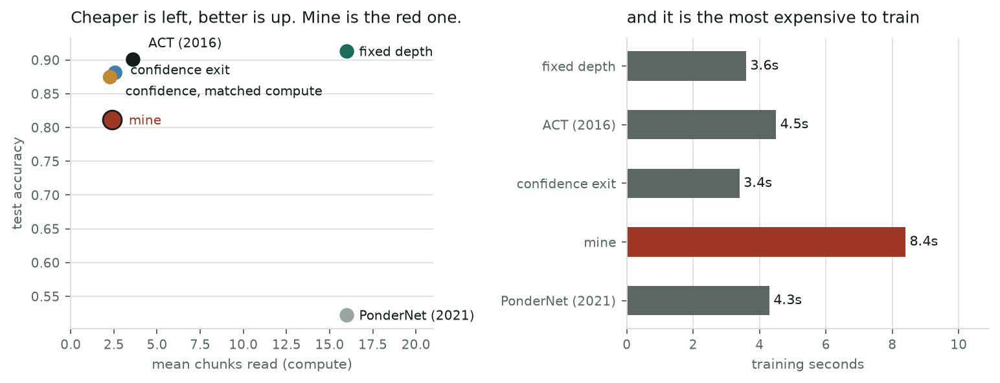

# Q-Neuro: Technical Breakdown

## Everything you need to rebuild this from scratch, including the bugs

This is the companion to the main report. The main report says what happened; this one says exactly
how, with the numbers, the equations, the hyperparameters, the commands, and — importantly — the
mistakes, because half of these were only findable by making them.

Everything ran on one 8 GB M2 MacBook Air, CPU only. If you have a GPU you can reproduce all of it
much faster.

---

# 1. The machine, and why it shaped everything

| | |
|---|---|
| Machine | Apple M2 MacBook Air, fanless |
| Memory | 8.0 GiB unified, 2.08 GiB free when measured |
| Cores | 8 physical, 4 torch threads |
| Accelerator | MPS present, `complex64` supported |
| CPU↔MPS crossover | **65,536 elements** — measured, not assumed |
| Working budget | 1.04 GiB (half of free memory, deliberately) |
| Precision | float64 for the analytic work, float32 elsewhere |

```bash
python -c "from qneuro3 import hardware; print(hardware.detect())"
```

Why half the memory? Because the machine has no fan. If you push it into swap, sustained throughput
falls off a cliff and you end up benchmarking the SSD. A smaller model that fits is faster than a
bigger model that swaps.

**Every model here is small enough that MPS never wins.** The measured crossover is 65,536 elements
and nothing in this project gets close, so it all runs on CPU. That is a measurement, not a
preference.

## 1.1 The constants that actually govern small models

I measured these because the asymptotic reasoning everyone uses is wrong at this scale.

| quantity | lookup core | streaming core |
|---|---:|---:|
| `c_step` — µs per example-step | 2.66 | 0.33 |
| `c_launch` — µs per iteration | 119.65 | 49.97 |
| `c_compact` — µs per compaction | 87.33 | 31.56 |


> At batch 1, starting a step costs **45× more** than doing one example's worth of work in it.

Any argument of the form "this is O(n) so it will be fast" is useless here. The fixed cost dominates
until the batch is large.

---

# 2. Sentinel: the equivalence machinery

## 2.1 The type system

`qneuro/equivalence/spec.py`

- `EquivalenceLevel`: **E0** symbolic identity, **E1** bit-exact in finite precision, **E2** survives
  an adversarial audit on a declared domain, **E3** distributional, **E4** aggregate metrics only.
- `TransportLevel`: **T0**…**T5**, grading what the map carries — parameters, gradients, optimiser
  moments, learning-rate policy, weight decay.
- `MapSpec.__post_init__` **raises** if you declare E0 or E1 alongside a domain restriction.

`qneuro/equivalence/certificate.py`

- `downgrade()` raises if you try to strengthen a certificate. There is no upgrade path.
- Non-`EquivalenceLevel` arguments raise `TypeError`.

`qneuro/equivalence/maps.py`

- `ParameterMap` exposes `supports_optimizer_transport`; `map_gradients()` raises
  `NotImplementedError` by default, so transport is opt-in and a map that cannot do it says so.

## 2.2 Every map family, and what it measured

| Map | Transport | First-update discrepancy |
|---|---|---|
| hidden-unit permutation | full | 1.192e-07 — one float32 ULP from summation order |
| diagonal / homogeneous scaling | full under `η → η·s²` | **exactly 0** for the SGD gradient step |
| same, with weight decay on | **impossible** | 3.405e-03 (SGD), 1.312e-04 (AdamW) |
| dense ↔ factorised | **refused** | no transport exists |
| complex ↔ realified | full | exactly 0 for AdamW, 1 ULP for SGD |
| complex ↔ exact-real | E2 on a domain | 5.245e-06 forward |


### The scaling derivation

Under a uniform scale `s`, gradients scale as `s⁻¹` per scaled layer. Optimiser state scales by the
gradient's power:

```python
_STATE_GRADIENT_POWER = {"exp_avg": 1, "momentum_buffer": 1,
                         "exp_avg_sq": 2, "max_exp_avg_sq": 2}
_LEARNING_RATE_EXPONENT = {"sgd": 2.0, "sgd_momentum": 2.0, "adam": 1.0, "adamw": 1.0}
```

SGD's update is `−η∇`, which picks up `s⁻¹`; matching the parameter's own `s` needs `η → η s²`.
**Adam's update is scale-free in the gradient**, so its exponent is 1 and the learning rate carries
over unchanged. That asymmetry is the whole mechanism behind the stability boundary below.

**Weight decay breaks this structurally.** The gradient step wants `η s²`, decoupled decay wants
`η s⁰`. No single learning-rate policy does both. That is a true fact about the pair, not a bug I
failed to fix.

## 2.3 The stability boundary

Under uniform scale `s` with an untransported learning rate, the update operator is
`I − (η/s²)H`, so the effective step is `η/s²` and it is stable exactly when

```
ρ = η · λmax(H) / (2 s²)  <  1
```

The source is stable when `ρ s² < 1`, so **for `s < 1` there is an open window where a model
converges and its exact equivalent diverges.**

| | SGD | AdamW |
|---|---:|---:|
| Cells | 1,476 | 1,476 |
| Prediction accuracy | **0.9912** | 0.5041 |
| False alarms (ρ ≤ 1 yet diverged) | **0** | — |
| Misses away from ρ = 1 | **0** | — |
| Diverged cells | 720 | **1** |

All 13 disagreements sit exactly at `ρ = 1.0`, where the spectral radius is 1 and neither verdict is
defined.

**And it fails completely on nonlinear models**: 96 of 96 cells at `ρ ≥ 1.1` converged, with growth
ratios of 1.03–1.27 against a threshold of 2.0. Written into the frozen prediction beforehand: `ρ`
uses curvature at initialisation and a ReLU network under cross-entropy relocates somewhere flatter.

**Implementation note.** `largest_hessian_eigenvalue` uses *shifted* power iteration on
Hessian-vector products — iterating on `H + cI` converges to the most positive eigenvalue rather
than the largest in magnitude, which is what actually governs blow-up.

## 2.4 The dimension law

```
rank(J_train) = min(n(C−1), P − g_arch)
d_free        = max(0, P − g_arch − n(C−1))
```

`g_arch` has two components, both textbook:

- **softmax common mode** — adding a constant vector to all logit rows changes nothing:
  `h_last + 1` directions, independent of the class count;
- **positive homogeneity** — if `φ(cx) = cφ(x)` then `(W₁,W₂) → (cW₁, W₂/c)` is exact: `h` more per
  homogeneous layer. So tanh gives `h+1` and ReLU gives `2h+1`, confirmed 8/8.

Measurement protocol: `g = P − rank(J_diff)` at `n = 600` saturation, singular-value tolerance
`1e-9·σmax`, float64, parameters at initialisation.

**All three frozen attempts at this still failed.** P1's substance held 126/126 but a 400-sample
probe cannot saturate rank when `P − g > 400(C−1)`, producing exactly 21 mismatches (3 configs × 7
values). I diagnosed it precisely and it is *still* recorded as compromised, because I changed the
measurement after seeing the failure. That rule cost me a defensible result and I would keep it.

---

# 3. Pulse: adaptive computation

## 3.1 The task

`qneuro3/tasks.py`. A permutation defines a **single cycle** through 24 nodes
(`perm[order] = order.roll(-1)`); the model starts somewhere and reports how many hops away node 0
is, capped at 8. Guessing gives 0.136.

The task's ground truth is checked against the walk itself in the test suite — the declared target
must be the first hop count landing on node 0, and the permutation must be verified as a single
cycle. I check this because **an earlier task design was unsolvable** and all ten candidate models
returned exactly 0.1441, which is what tipped me off.

## 3.2 The core, and the bug that hid inside it

```python
attn = softmax(keys @ h / sqrt(d))
h    = h + step(concat[h, (attn * values).sum(1)])
```

Chain following is an **associative lookup**: match the current node against its identity (the key),
read its successor (the value). My first version used **one embedding for both**, which makes the
lookup impossible. Everything sat at or below the 0.136 guessing baseline and I nearly concluded
that recurrent chain-following does not work.

## 3.3 The halting arithmetic

```python
log_not   = log1p(-p)
cum       = cat([zeros, log_not[:, :-1].cumsum(1)], dim=1)
log_first = log(p) + cum          # log P(first firing at step k)
loss      = -log_first[distance - 1].mean()
```

Two invariants are tested rather than assumed: the masses sum to **at most** 1, falling short by
exactly `Π(1−p_k)` — the probability of never firing, which is information — and moving mass onto
the true step must lower the loss.

## 3.4 The ladder, with ablations

| Model | Halting rule | Params | Accuracy | Steps |
|---|---|---:|---|---:|
| `Q0Fixed` | always 8 steps | 28,360 | 1.0000 | 8.00 |
| `Q1Elastic` | PonderNet-style mixture | 28,425 | 0.6241 | 3.27 |
| `Q2Commit` | hard commit, straight-through | 28,425 | 0.9999 | 8.00 |
| `Q3Arrival` | halt on detected arrival | **27,970** | 0.9994–1.0000 | **4.54** |
| `Q4Grounded` | Q3 + training-only grounding | 27,970 | 0.6322–0.9500 | 4.50–5.33 |

| Ablation | Effect | Reading |
|---|---|---|
| shared → separate key/value | ≤0.136 → 1.0000 | chain following needs an associative lookup |
| fixed depth → mixture halting | 1.0000 → 0.6241 | ponder collapse |
| mixture → hard commit | 0.6241 → 0.9999 | the mixture was the defect, not the halting |
| commit → halt on arrival | 8.00 → 4.54 steps | the saving is real, on 6 of 10 seeds |
| + position grounding | bimodal → 0.63–0.95 | variance cured by destroying the good mode |
| halt bias −5.0 → −2.0 | no change | collapse is not an initialisation artifact |

## 3.5 Reliability

Twenty runs across two task constructions and two training budgets: **7 of 20** reach ≥0.99. The
distribution is bimodal with nothing between 0.5664 and 0.9994. Training volume is irrelevant; the
seed decides.

**Matched control:** `Q0Fixed` under identical conditions is **10 of 10**, minimum 0.9919. So the
task and budget are fine; the unreliability belongs to the architecture.

**The fix.** RMS-normalise the state after each hop. In the variant sweep that takes the baseline
from 3/6 seeds to **6/6**, all landing on exactly 1.0000 at 4.54 steps; it then confirmed at
**20/20**. `Core(normalise=...)` defaults to `False` so every cycle-1 record still reproduces
bit-for-bit. After the fix, on ten seeds: accuracy 1.0000 and halt accuracy 1.0000
on all ten, ECE 0.0018–0.0021, and 9 of 12 hyperparameter configurations perfect — all three
failures at `lr = 5e-4`, which is simply too small to converge in the budget.


**It is an interaction, not a main effect.** The same normalisation takes the fixed-depth model from
1.0000 down to 0.1281–0.2483, because an unnormalised residual state carries magnitude information
that the distance readout uses.

## 3.6 Execution policies

`qneuro3/runtime.py`. Four, all required to produce **identical answers** (`verify_equivalence`,
enforced in the test suite):

| Policy | Executed rows | Notes |
|---|---|---|
| `lockstep` | `n · max_i d_i` | the confirmed baseline |
| `compacted` | **`Σ_i d_i`** (ideal) | one gather per halting iteration |
| `bucketed` | between the two | needs a depth predictor |
| `continuous` | `Σ_i d_i` | constant in-flight width; needs a request queue |

Measured executed rows at batch 256: lockstep 8192, compacted **1441** (= ideal), compacted-every-4
1916, bucketed-with-oracle 2944, continuous 1441. Straggler waste 5.68×.

> **A real bug the equivalence check caught.** With deferred compaction, a row that has fired keeps
> being advanced until the next gather, its halt probability stays above threshold, and it
> overwrites its own answer with a later step's logits. 13 rows wrong at batch 16, 215 at batch 256.
> Nobody would have noticed this in a timing table.

## 3.7 The ceiling

```
E[max] = Σ_k  k · ( F(k)^n − F(k−1)^n )
```

For `P(k) ∝ 0.8^k` on 1..32:

| batch | 1 | 8 | 32 | 64 | 256 | 1024 |
|---|---:|---:|---:|---:|---:|---:|
| E[max halt] | 4.97 | 12.53 | 18.22 | 20.96 | 25.86 | 29.42 |
| realisable saving | 6.43× | 2.55× | 1.76× | 1.53× | 1.24× | 1.09× |


This applies to ACT, PonderNet, early-exit transformers and depth-routed mixtures alike.


## 3.8 The cost model, and why it failed

```
T  = c_step · rows + c_launch · iterations + c_compact · compactions
n* = c_compact · E[max] / (c_step · (E[max] − E[d]))
```

| | streaming | lookup |
|---|---:|---:|
| predicted crossover | 112 | 45 |
| **measured crossover** | **64** | **< 16** |

Frozen as `QNEURO3-RUNTIME-P1` and **failed**. It is accurate where compute dominates (1.0% error at
batch 128, 11.5% at 256) and wrong where overhead does (55% at batch 16), because it over-charged
compaction at small batch — 15 modelled compactions against 10 measured — using a `c_compact`
measured on a synthetic gather of all six state tensors. Kill condition applied; the equation was
**not** patched and re-issued.


## 3.9 The M2 sweep

| batch | select | lockstep | compacted | rows/ex | planner picks |
|---:|---:|---:|---:|---:|---|
| 1 | 1504.4 | **417.5** | 469.2 | 5.0 | lockstep |
| 4 | 662.2 | **201.7** | 222.5 | 4.3 | lockstep |
| 8 | 374.7 | 361.0 | **331.0** | 6.5 | lockstep |
| 16 | 261.3 | 245.0 | **198.7** | 5.6 | compacted |
| 32 | 180.9 | 162.4 | **124.9** | 5.2 | compacted |
| 64 | 119.1 | 106.1 | **76.3** | 4.9 | compacted |
| 128 | 89.8 | 88.9 | **57.1** | 5.5 | compacted |
| 256 | 72.1 | 71.9 | **38.7** | 5.5 | compacted |


Median µs per example. Throughput at batch 256: 13,872/s → 25,841/s. Analytic peak activation
memory 1,536 KiB → 457 KiB. The planner matches the measured optimum at 8 of 9 sizes; it is
conservative at batch 8, where compaction already wins by 1.09%.

**Measured RSS deltas are all 0.00** because `ru_maxrss` is a high-water mark that never falls. That
is why the memory figure is analytic, and it is stated rather than hidden.

## 3.10 Real data

UCI HAR, archive sha256 `c00b803081a5c797cd5e4b83700a9810b38d53d9d84e01917e090e1fdbc81031`,
CC BY 4.0. 9 inertial channels × 128 timesteps → 16 chunks of 8; 6 classes.

**Canonical subject-disjoint split**, used exactly as shipped: train subjects
{7,8,11,14,15,16,17,19,21,22,23,25,26,27,28,29,30}, validation {1,3,5,6} (the four lowest IDs, fixed
in advance so I could not tune it), test {2,4,9,10,12,13,18,20,24}. Standardised with train
statistics only. Protocol frozen before the test subjects were read.

| arm | test acc | mean chunks | p95 | train s |
|---|---:|---:|---:|---:|
| fixed | 0.9127 | 16.00 | 16.00 | 3.6 |
| act | **0.9006** | **3.61** | 10.33 | 4.5 |
| confidence | 0.8811 | 2.57 | 13.00 | 3.4 |
| confidence @ matched compute | 0.8747 | 2.28 | 10.00 | 3.4 |
| supervised (mine) | 0.8112 | 2.39 | 15.67 | **8.4** |
| pondernet | 0.5220 | 16.00 | 16.00 | 4.3 |



All arms at **63,271 parameters**, three seeds. The matched-compute threshold is chosen on
**validation** to match my arm's validation chunk count, then applied to test; test is never
consulted in the choice.

> PonderNet collapsed and I treat that as my implementation's fault, not the method's. ACT working
> well on the same core suggests the harness is fair — and a correct PonderNet would rank *above*
> me, so the error does not flatter my result.

---

# 4. Nova: the architecture search

## 4.1 The task suite

`nova/tasks.py`. Uniform interface: `(B,L)` int tokens in, `(B,L)` targets plus a scored mask.
Trained at lengths 8–16, evaluated at 16, 32 and 64.

| task | what it requires |
|---|---|
| `parity_scan` | running state, unbounded accumulation |
| `mod_sum` | running state, modular arithmetic |
| `cummax` | running state, order statistics |
| `dyck_depth` | counter / stack depth |
| `copy` | verbatim memory over a delay |
| `reverse` | memory plus order inversion |
| `sort` | global comparison, not a left-to-right scan |
| `needle` | content-addressed retrieval |

## 4.2 The shortcut audit

Three degenerate predictors, fitted on one sample and scored on another:

| task | chance | position only | token only | prev token | verdict |
|---|---:|---:|---:|---:|---|
| parity_scan | 0.501 | 0.501 | 0.529 | 0.499 | keep |
| mod_sum | 0.145 | 0.143 | 0.156 | 0.143 | keep |
| copy | 0.126 | 0.125 | 0.127 | 0.000 | keep |
| reverse | 0.126 | 0.125 | 0.127 | 0.000 | keep |
| needle | 0.131 | 0.116 | 0.126 | 0.000 | keep |
| **cummax** | 0.609 | **0.887** | 0.887 | 0.150 | **drop** |
| **sort** | 0.126 | **0.598** | 0.127 | 0.000 | **drop** |


My deliberately weak `causal_mlp` control had scored **0.917 on sort**. Without this audit that is a
discovery.

## 4.3 The zoo

`nova/zoo.py`, all causal, all verified finite and causal in the test suite:

transformer with RoPE / ALiBi / learned positions, GRU, LSTM, diagonal SSM (S4D-style), selective SSM
(Mamba-style input-dependent decay), linear attention, retention, causal MLP.

**Parameter matching.** `match_parameters` searches width for a 120k target and lands within 13%
across families. This matters: these families differ by 8× in parameters at equal width, so
comparing at a fixed `d` would be comparing model sizes, not architectures. The search steps by 8 so
that `d/heads` stays even — rotary embeddings split the head dimension in half and an odd head
dimension makes the two halves different sizes.


> **A bug the causality probe caught.** The diagonal SSM initialised its decay as
> `linspace(-3.0, -0.05).log()` — the log of negative numbers, so NaN everywhere. The probe reported
> "not causal" when the real answer was "not finite". Now it is `sigmoid` of a raw logit.

## 4.4 The candidates

`nova/candidates.py`. Every entry differs from a named control by exactly one flag.

**Attention normalisers** — `softmax` (control), `softmax_rms` (confound control), `logl`, `max`,
`threshold`:

```python
if normaliser == "max":
    shifted = scores - scores.amax(-1, keepdim=True)
    weights = shifted.exp().masked_fill(mask, 0.0)   # NO sum normalisation
```

> **The bug that invalidated the whole first run.** My original `max` divided by the sum at the end,
> which is *algebraically exactly softmax*. It produced numbers identical to the control to three
> decimals. That is how I caught it, and until then I had not tested my hypothesis at all. There is
> now a regression test: `test_max_normaliser_is_not_secretly_softmax`.

**Operator-level probe** — read drift when 24 low-signal distractors are inserted before the query:

| softmax | logl | max | threshold |
|---:|---:|---:|---:|
| 0.7243 | 0.5277 | **0.2356** | **0.2356** |

The property is real. It just does not help.


**Other families:** `RecurrentRetrieval` (LSTM + attention, normaliser selectable, optional
branch dropout), `LateFusion` (disjoint parameters, gated), `LoopedTransformer` (weight-shared
depth), `CursorMemory` (relative-shift pointer), `CursorAttention` (all three routes).

## 4.5 The training protocol, identical for everything

AdamW at 3e-3 with a one-cycle schedule, **2400 steps**, batch 64, gradient-norm clip 1.0,
cross-entropy over scored positions only, training lengths sampled uniformly from 8–16, ~120k
parameters, three seeds fixed in advance as 0, 1, 2.

> **The budget confound.** My first sweep used 800 steps and was undertrained. The hybrid's mod-sum
> reads **0.291 at 800 steps and 0.776 at 2400** — an apparent catastrophic interference effect that
> was three times larger than reality. Every headline number in Nova was re-measured. Check your
> budget before your hypothesis.

## 4.6 The frontier


| architecture | parity | mod_sum | copy | reverse | needle | mean | params |
|---|---:|---:|---:|---:|---:|---:|---:|
| cursor_attn | 1.000 | 0.998 | 0.340 | 0.146 | 0.977 | **0.692** | 111,191 |
| rnn_attn_max | 0.937 | 0.776 | 0.301 | 0.244 | **1.000** | 0.652 | 118,739 |
| cursor | 1.000 | 0.999 | **0.398** | 0.348 | 0.344 | 0.618 | 131,055 |
| lstm | **1.000** | **1.000** | 0.126 | **0.371** | 0.371 | 0.574 | 128,675 |
| late_fusion_gated | 1.000 | 0.363 | 0.360 | 0.157 | 0.471 | 0.470 | 131,751 |
| attn_threshold | 0.594 | 0.367 | **0.470** | 0.157 | 0.600 | 0.438 | 116,670 |
| transformer_rope | 0.580 | 0.389 | 0.291 | 0.153 | 0.656 | 0.414 | 116,667 |
| *chance* | *0.501* | *0.145* | *0.126* | *0.126* | *0.131* | | |

## 4.7 The three hypotheses

**H-DILUTION**, five seeds, copy at 4× length:

| softmax (control) | softmax + RMS | max | threshold |
|---:|---:|---:|---:|
| 0.172 ± 0.051 | **0.305 ± 0.041** | 0.321 ± 0.046 | 0.377 ± 0.093 |

The confound control captures the whole effect. `max` is inside noise of it. Needle is flat across
all four (0.576–0.609). **Not supported.**

**H-INTERFERENCE-P1** (`eccf380427d9f004`), mean of 3 seeds at 4× length:

| arm | mod_sum | needle | copy | parity |
|---|---:|---:|---:|---:|
| no dropout | 0.291 | 0.841 | 0.309 | 0.948 |
| dropout 25% | 0.284 | 0.591 | 0.147 | 1.000 |
| dropout 50% | 0.596 | 0.260 | 0.128 | 1.000 |
| dropout 75% | 0.498 | 0.259 | 0.139 | 1.000 |
| LSTM alone | **0.992** | 0.283 | 0.147 | 1.000 |

All four clauses failed. At 50% dropout the model has essentially *become* an LSTM.

**Branch ablation at test time, no retraining** — the intervention that distinguished override from
pre-emption:

| ablation | mod_sum @64 | needle @64 |
|---|---:|---:|
| none | 0.291 | 0.841 |
| attention off | 0.157 | 0.117 |
| recurrence off | 0.161 | 0.167 |

Reproduce with `python experiments/run_nova_branch_ablation.py`; the record is
`research/nova/NOVA-BRANCH-ABLATION-001.json`.


Neither branch works alone. The recurrence never learned the automaton.

**H-COMPOSE-P1** (`9f9934283056faa1`): mean 0.692 against a required 0.75; reverse 0.146 against a
per-task best of 0.371, a gap of 0.225 where the criterion allowed 0.15. C3 passed — mod-sum
0.776 → 0.998 with needle at 0.977. **The conflict moved.**

---

# 5. Every measurement defect, and what caught it

Each of these produced a plausible, reportable, wrong answer.


| Defect | What it claimed | Cause | What caught it |
|---|---|---|---|
| NaN misclassification | runaway runs **converged** | a norm overflows before its entries do, so `inf/inf = nan` and `nan > t` is `False` | an exact-ρ probe disagreeing with the sweep |
| Sign error in a bound | ratios **below 1.0** | `S⁻¹` applied once too often | the invariant was written as a test |
| Threshold artifact | 6/16 systems bifurcate | crossings of an arbitrary line | a proper bimodality statistic |
| Pre-asymptotic fit | a clean `T^0.625` exponent | fitting inside a transient | `M/√T` was not constant |
| Holonomy metric | a geometric phase | convergence drift | a stay-control that beat every loop |
| Tautological feature | perfect within-family agreement | `e₀ = 0` makes two features identical | identical to 16 significant figures |
| Probe saturation | a law violated in 21 cells | 400 samples cannot saturate rank | exact arithmetic: 3 configs × 7 values |
| Unsolvable task | ten architectures tie | the target was ambiguous | all ten returned exactly 0.1441 |
| Shared key/value | recurrent lookup fails | the associative read was impossible | accuracy pinned at the guessing baseline |
| SSM NaN | model "not causal" | `log()` of a negative linspace | a causality probe with a finiteness check |
| Normaliser identity | a novel operator | dividing by the sum after the max **is** softmax | identical to the control to three decimals |
| Missing confound control | length invariance helps | normalisation on candidates only | the control captured the whole effect |
| Undertraining | catastrophic interference | 800 steps was not convergence | re-running at 2400 |
| Weak instrument | a discovery on `sort` | position alone scores 0.598 | the shortcut audit |
| Hash non-determinism | a frozen prediction | int keys sort differently after a JSON round-trip | re-verifying from disk |
| Cost accounting | adaptive width is a 2× win | fixed-depth arms charged only to their selected step | the static-width control |

The corrected transport-bound expression, for the record:
`inverse_scale * (hessian @ (inverse_scale * target) − linear_term)`.

## 5.1 The prior-art firewall

Before any mechanism could be called new it had to survive a search for who published it first. None
of them did. Full citations are in `docs/NOVA_PRIOR_ART.md` and `docs/PRIOR_ART_RUNTIME.md`; this is
the summary.


The rule I applied: **different terminology is not novelty.** Twice I had a mechanism working before
I found its name in the literature, and both times the honest move was to keep the implementation as
a baseline and drop the claim.

---

# 6. Reproducing all of it

```bash
cd <repo root>
export PYTHONPATH="$PWD"

# 0. environment and invariants
python -c "from qneuro3 import hardware; print(hardware.detect())"
python -m pytest -q && ruff check . && python scripts/verify_release.py

# 1. the equivalence compiler, in ladder order
python experiments/run_qe_000002.py    # permutation
python experiments/run_qe_000003.py    # scaling orbit
python experiments/run_qe_000004.py    # dense/factorised — refuses transport
python experiments/run_qe_000001.py    # complex/exact-real — E2 on a domain
python experiments/run_qe_000006.py    # native complex

# 2. the gates
python experiments/run_qe_000008.py    # Gate C: bound non-vacuity
python experiments/run_qe_000009.py    # Gate D: cross-family — FAILS
python experiments/run_qe_000010.py    # refuses to freeze; exits non-zero

# 3. adaptive computation
python experiments/run_qneuro3_cycle_001.py all
python experiments/run_qneuro3_cycle_002.py all
make reproduce-q3

# 4. the architecture search
make smoke-nova
make reproduce-nova
make nova-figures
```

**Expected:** Gate D fails, `run_qe_000010.py` refuses to freeze, the nonlinear confirmation fails,
cycle 1 closes on a kill condition, `transfer` fails and `niche` passes, and Nova returns NO.
**Those are the results, not errors in your reproduction.**

## 6.1 Repository state

| | |
|---|---|
| Tests | 299 |
| Lint | ruff clean |
| Release verification | 22/22 |
| Adversarial claim audit | pass |
| Preserved failures | 39 |
| Frozen predictions | 19, one passed |

**Frozen and never modified:** `experiments/results/**`,
`research/laws/FROZEN_CANDIDATE_001.json`, `docs/PREREGISTRATION_NEXT_PHASE.md`,
`docs/PROVISIONAL_LAW_FREEZE.md`, released manuscript binaries.

## 6.2 The freeze protocol

1. Serialise the prediction; SHA-256 the serialisation.
2. The test **reads its thresholds out of the frozen record** and verifies the hash at load, so the
   code cannot drift from the prediction it is testing.
3. One attempt. Record the verdict whichever way it comes out.

> **A frozen prediction whose hash cannot be re-verified FROM DISK is not frozen.** Integer keys
> sort numerically in memory and lexicographically after a JSON reload, so one of my hashes did not
> round-trip. Caught before any evidence existed, and it changed the procedure.

---

# 7. What I would do differently

**Audit the instrument before the hypothesis.** Two of my eight Nova tasks were broken. I found out
by accident, late, and only because a weak control scored suspiciously well.

**Write the confound control at the same time as the candidate.** Every one of my candidate arms
needed a post-read normalisation that the control did not have. I built the candidate first and the
control second, and in between I believed a false thing.

**Check the training budget before believing an effect size.** A three-times-too-large effect
survived several days of my thinking because I never asked whether 800 steps was convergence.

**Never report compute without accuracy.** The single most transferable thing here: a broken
adaptive model reports a completely healthy-looking step count.
