# Q-Neuro: From Helix to Nova

## A textbook written by the person who needed it

I am a high school student. I taught myself all of this because I wanted to invent a new kind of
neural network, and I could not find a book that took me from "what is a matrix" all the way to
"here is why my idea was wrong and how I proved it."

So this is that book. Sixteen parts. It starts with the mathematics and ends with the open problems
I could not solve. Every number in it came off my own laptop, and every failure in it is mine.

**How to read it.** Books I and II are the background — read them if you need them, skip them if you
don't. Books III to VIII are the actual research, in the order it happened. Books IX to XII are the
methods I wish someone had taught me first. Books XIII and XIV are a boundary I mapped and did not
cross. Books XV and XVI are the failures and the questions.

**A warning about tone.** This book spends more words on things that did not work than on things
that did. That is not modesty. It is the ratio of the real work: nineteen frozen predictions, one
pass.

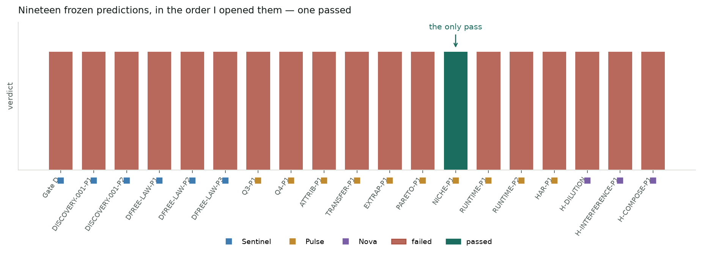

---

# BOOK I — MATHEMATICS FOR NEURAL MACHINES

## I.1 Why this book starts here

Every wrong idea in this project failed for a mathematical reason, and every one of those reasons is
in this chapter. Not advanced mathematics — undergraduate at most. But the specific pieces matter,
and one of them (order statistics) is not taught in any machine learning course I could find, and it
is the piece that killed my best result.

## I.2 Vectors, matrices, and what a layer is

A vector is a list of numbers. A matrix is a grid of them. A neural network layer is

```
y = f(Wx + b)
```

`x` is your input vector, `W` a matrix of weights, `b` a bias vector, `f` a nonlinear function
applied element by element. That is the whole object. Stack a few and you have a network.

Two facts do real work later:

**Matrix multiplication is not commutative.** `AB ≠ BA`. This is why the order of operations in an
architecture is a design decision and not a formality — my halting head read the wrong state for two
days because I had one operation before another.

**A linear map cannot express a comparison.** If you concatenate two vectors `[a, b]` and multiply by
a matrix, you get `W₁a + W₂b`. There is no way to make that large when `a = b` and small otherwise,
because it is *additive* in the two arguments and equality is not. If you want "are these the same?"
you need a *product* — `a · b` — somewhere. I lost days to this exact bug, and it is the reason the
model in Book V uses `carried * query` rather than `concat[carried, query]`.

## I.3 Eigenvalues, and why models blow up

For a square matrix `A`, if `Av = λv` for some non-zero vector `v`, then `λ` is an eigenvalue. The
largest `|λ|` is the **spectral radius**, `ρ(A)`.

Why you care: repeatedly applying `A` multiplies things by roughly `ρ(A)` each time. If
`ρ(A) > 1`, everything explodes; if `ρ(A) < 1`, everything decays to zero. Gradient descent is
repeated application of `I − ηH`, where `H` is the curvature (the Hessian). So training is stable
when

```
|1 − η λmax(H)| < 1     which means     η < 2 / λmax(H)
```

This gives a dimensionless quantity worth naming:

```
ρ = η · λmax(H) / 2
```

Stable when `ρ < 1`. In Book IV I predicted 1,476 convergence outcomes from this alone and got 99.12%
of them right, with zero false alarms — and then watched it fail completely on nonlinear models,
for a reason I had written down in advance.

**How to compute `λmax` without ever building `H`.** `H` is `P × P` where `P` is your parameter
count — far too big to store. But you can compute `Hv` for any vector `v` with two backward passes,
and power iteration only needs `Hv`:

```python
v = random_unit_vector()
for _ in range(iterations):
    v = hessian_vector_product(v)
    v = v / v.norm()
```

One catch, which cost me an afternoon: plain power iteration converges to the eigenvalue largest *in
magnitude*, which might be a large **negative** one. Blow-up is governed by the most **positive**
one. Fix: iterate on `H + cI` for a large positive `c`, then subtract `c`.

## I.4 Derivatives, gradients, and Jacobians

The gradient `∇L` is the vector of partial derivatives of the loss with respect to each parameter —
the direction of steepest increase, so you step the other way.

The **Jacobian** is the matrix of derivatives of every output with respect to every parameter. Its
**rank** is the number of genuinely independent directions in it. This matters more than it sounds:

> If your Jacobian has rank `r` out of `P` parameters, then there are `P − r` directions you can
> move the parameters in that change **nothing at all** about the model's outputs.

Those directions are the model's *gauge freedom*, and Book IV is largely about counting them.

## I.5 Probability, likelihood, and the loss you actually minimise

A model that outputs a probability distribution `p(y|x)` is scored by the **negative log
likelihood**, `−log p(y_true|x)`. For classification with a softmax output, that is exactly
cross-entropy. Minimising it means making the true answer probable.

The softmax turns arbitrary numbers ("logits") into a distribution:

```
softmax(z)_i = exp(z_i) / Σ_j exp(z_j)
```

Two properties bite later. First, **adding a constant to every logit changes nothing** — that is a
gauge freedom, and it shows up in the dimension law of Book IV. Second, **the denominator sums over
everything**, so adding more candidates takes probability away from the ones already there. That is
the hypothesis Book VI tests and fails to confirm.

## I.6 Information, entropy, and calibration

A model is **calibrated** if, when it says 70%, it is right about 70% of the time. Expected
calibration error (ECE) bins predictions by confidence and averages `|confidence − accuracy|` across
the bins.

Accuracy and calibration are different things. A model can be right often and badly calibrated, or
poorly performing and honest about it. Book V's halting mechanism reaches ECE 0.0018–0.0021 across
ten seeds, which is the one part of that result I remain happy with.

## I.7 Optimisation

**SGD**: `θ ← θ − η ∇L`. **Adam / AdamW**: keep running averages of the gradient and its square, and
divide the step by the square root of the second one.

The single most important structural difference, which Book IV turns into a theorem:

> **SGD's step scales with the gradient. Adam's does not.** Adam divides by the gradient's own
> magnitude, so multiplying every gradient by a constant leaves Adam's update unchanged.

That is why, under a rescaling of the model, SGD needs its learning rate rescaled by `s²` and Adam
does not.

## I.8 Order statistics — the piece nobody teaches, and the one that mattered

If you have `n` independent samples from a distribution with CDF `F`, the largest of them has CDF
`F(k)ⁿ`. So

```
E[max] = Σ_k  k · ( F(k)^n − F(k−1)^n )
```

Read that carefully, because it is the mathematical heart of this entire project.

Suppose each example in a batch needs a different amount of computation, averaging 5 steps. Run them
one at a time and you pay 5 steps each. Run 256 of them together in lockstep and **everyone waits for
the slowest**, so you pay `E[max]` — which for a realistic distribution is about 26.

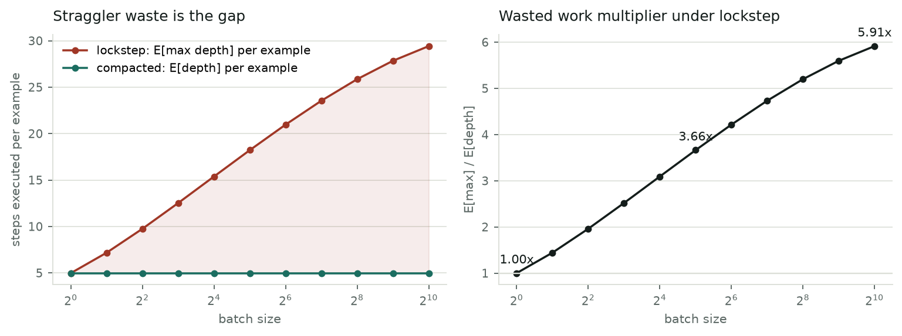

The saving from adaptive computation does not shrink because the method is bad. It shrinks because
`E[max] → max` as `n` grows, and it does so *fast*. This is a property of maxima, not of neural
networks, and it applies to every per-example adaptive-compute method ever published.

## I.9 Complexity, and what "cheap" means

Big-O counts operations as the problem grows. It is the right tool for large problems and the wrong
tool for mine, because on a small model the constants dominate completely.

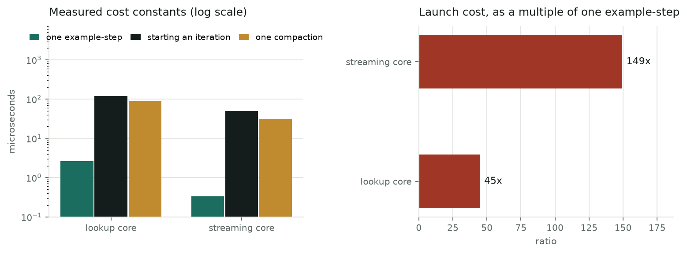

On my laptop, launching one iteration costs 119.65 µs and doing one example's worth of work in it
costs 2.66 µs. At batch 1, **overhead is 45× the work**. Any argument of the form "this is O(n), so
it will be fast" is meaningless here. Measure.

---

# BOOK II — HOW MODERN AI COMPUTES

## II.1 The MLP

Stacked `y = f(Wx + b)` layers. Given enough width, an MLP can approximate any continuous function —
which sounds impressive and tells you almost nothing, because it says nothing about whether training
will *find* that function, or whether it will work on inputs longer than the ones you trained on.

I kept a deliberately weak MLP as a control throughout Book VI, and it caught two broken tasks by
scoring far too well on them.

## II.2 Recurrence: GRU and LSTM

A recurrent network carries a state `h` and updates it one token at a time:

```
h_t = update(h_{t-1}, x_t)
```

The **LSTM** adds a separate cell state with multiplicative gates deciding what to keep, forget and
output. The gates matter because a plain recurrent update multiplies the state by a matrix every
step, and repeated multiplication either explodes or vanishes (see I.3).

Here is the thing that surprised me most in this whole project: **on tasks that require tracking a
running state, a 1997 LSTM beats everything I built and everything modern I tested**, and it does so
at four times the training length. Parity 1.000, mod-sum 1.000. Nothing I tried improved on that.

## II.3 Attention and the transformer

Attention compares a query against a set of keys, turns the comparison into weights, and returns the
weighted average of the values:

```
attention(q, K, V) = softmax(qᵀK / √d) V
```

It is content-addressed memory: "find the entry that matches this, and give me what is stored there."
Transformers stack this with MLPs and position information.

The `√d` is a scale correction: the dot product of two random `d`-dimensional vectors grows like
`√d`, and without dividing, the softmax saturates and gradients vanish.

**Attention's weakness is in the softmax denominator.** It sums over every candidate, so the read
changes when you add candidates that do not match. I measured this directly: inserting 24
low-signal distractors before the query shifts a softmax read by 0.7243. That is real, it is
measurable, and Book VI shows it does not translate into the benefit you would expect.

## II.4 State-space models

S4, Mamba and friends: a linear recurrence chosen so it can be evaluated in parallel, giving
recurrence's sequential state with attention's training speed.

```
h_t = A h_{t-1} + B x_t
y_t = C h_t
```

with `A` diagonal so it factors. In Mamba-style models `A`, `B` and `C` depend on the input, which is
what makes them selective.

> **A bug worth learning from.** My diagonal SSM initialised its decay as
> `linspace(-3.0, -0.05).log()` — the logarithm of negative numbers, which is NaN. My causality probe
> reported "this model is not causal." The real answer was "this model is not finite." Always test
> for finiteness before you test for anything else, or your diagnostics will lie to you.

## II.5 Adaptive computation

Fixed-depth networks spend the same compute on every input, which is obviously wasteful. Adaptive
computation lets the model decide when to stop.

- **ACT** (Graves, 2016) accumulates a halting probability per step and stops when it passes 1,
  with a penalty term encouraging fewer steps.
- **PonderNet** (Banino et al., 2021) treats the halting step as a random variable and trains the
  expected loss over that distribution.
- **Early-exit** networks attach a classifier at each layer and stop when confident.

Book V builds a fourth kind — halt when a *supervised predicate* says the answer is available — and
then shows exactly how narrow the conditions are under which that is worth doing.

## II.6 Mixture-of-experts and conditional computation

Route each token to a few of many expert sub-networks: more parameters, similar compute. This is
conditional computation in the *width* dimension, where adaptive halting is conditional computation
in the *depth* dimension.

I tested width routing too. It briefly looked like a 2× Pareto win, until I found that my fixed-depth
control was being charged only for its selected step instead of all of them — a 4× undercount. After
the fix the effect vanished. See Book XI.

---

# BOOK III — Q-NEURO HELIX

## III.1 The idea, taken seriously

The first version of Q-Neuro was built on complex-valued state. The pitch: represent each unit as a
complex number, and you get magnitude and phase — amplitude for "how strongly does this fire" and
phase for "when," which felt like it should let a network bind features together the way theories of
neural oscillation suggest.

I built it. It trained. It produced beautiful plots.

## III.2 Why it looked convincing

Because I never ran the control that mattered. I compared complex Q-Neuro against a real-valued
network of the same *width*, which meant the complex model had twice as many real parameters. It won.
Of course it won.

I also had a "geometric phase" measurement — carry the state around a closed loop and it comes back
rotated, which is a real phenomenon in physics and would have been interesting here.

## III.3 The cracks, in order

1. **The parameter count.** A complex `d`-dimensional layer has `2d` real numbers.
2. **The realification.** A complex multiply is exactly a real 2×2 matrix multiply with a specific
   structure. So a complex layer *is* a real layer with tied weights — a constraint, not a new
   capability.
3. **The holonomy.** My loop measurement had no stay-control. When I added one — hold the state still
   for the same number of steps and measure the drift — the stay-control drifted *more* than the
   loop. I was measuring convergence, not geometry.
4. **The biology.** Every biological justification I had written turned out to be decoration. Remove
   it and nothing in the model changes.

## III.4 The decisive control

Match the *parameters*, not the width. Under matched parameters the complex model and the real model
perform the same, because — as the realification shows — they are the same model.

## III.5 The lesson Helix paid for

> **The control you don't want to run is the one that decides.**

I knew about parameter matching. I did not apply it, because the result was already good and I did
not want to find out. Everything after Helix is organised around not being able to do that again:
predictions frozen before the run, controls written at the same time as the candidate, and kill
conditions written down in advance.

---

# BOOK IV — Q-NEURO SENTINEL

## IV.1 Equivalence is not a property of two models

Sentinel started from a question that sounds academic and turns out to be load-bearing: when are two
neural networks *the same model*?

The naive answer is "when they compute the same function." That is not enough for anything you would
want to do with the answer, because two networks can compute the same function and behave completely
differently under training.

So I built a type system with two axes.

**How equal are the outputs?**

| level | meaning |
|---|---|
| E0 | symbolically identical |
| E1 | bit-exact in finite precision |
| E2 | survives an adversarial audit on a declared domain |
| E3 | same distribution |
| E4 | same aggregate metrics |

**How much does the map carry?** T0 through T5, grading whether the correspondence survives
parameters only, or also gradients, optimiser moments, learning-rate policy and weight decay.

The type system *enforces* things. `MapSpec` raises if you declare E0 or E1 alongside a domain
restriction, because "symbolically identical, but only on this subset" is incoherent. Certificates
can be downgraded and never upgraded. A map that cannot transport gradients has to say so — the
default `map_gradients` raises `NotImplementedError`.

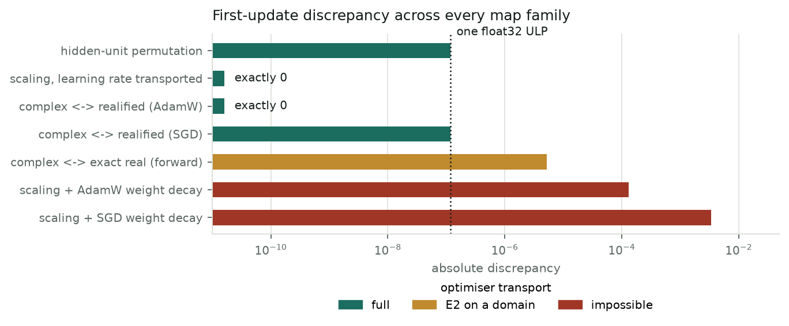

## IV.2 Transport-degeneracy, and how it caught its own programme

Here is the result I am proudest of, and it is a negative one.

Take a network and scale one layer up by `s` and the next down by `1/s`. The function is unchanged.
Under plain SGD you can transport this exactly, if you also scale the learning rate by `s²`.

Now turn on decoupled weight decay. The gradient step wants `η s²`. The decay term wants `η s⁰`. **No
single learning-rate policy satisfies both.** The transport is not hard, it is *impossible* — and
weight decay is on by default in every modern training setup.

Measured discrepancy after one update with decay enabled: **3.405e-03** for SGD and **1.312e-04** for
AdamW, against a float32 ULP of 1.192e-07. Not a numerical artifact. A structural one.

## IV.3 The scaling orbit, derived

Under a uniform scale `s`, gradients scale as `s⁻¹`. Optimiser state scales by the gradient's power:

```python
_STATE_GRADIENT_POWER = {"exp_avg": 1, "momentum_buffer": 1,
                         "exp_avg_sq": 2, "max_exp_avg_sq": 2}
_LEARNING_RATE_EXPONENT = {"sgd": 2.0, "sgd_momentum": 2.0, "adam": 1.0, "adamw": 1.0}
```

SGD's update `−η∇` picks up `s⁻¹`, so matching the parameter's own `s` needs `η → η s²`. Adam's
update is scale-free in the gradient (I.7), so its exponent is 1.

That asymmetry is not a curiosity — it is the entire mechanism behind the next section.

## IV.4 The transport-covariance conjecture, and its death

If two models are exactly equivalent, do they train the same way?

**No.** Under uniform scale `s` with an untransported learning rate, the effective step becomes
`η/s²`, so stability is governed by

```
ρ = η · λmax(H) / (2 s²)
```

The source model is stable when `ρ s² < 1`. So **for `s < 1` there is an open window where a model
converges and its exact equivalent diverges.** Same function. Same predictions. Opposite training
outcomes.

I froze that prediction and tested 1,476 configurations.

| | SGD | AdamW |
|---|---:|---:|
| prediction accuracy | **0.9912** | 0.5041 |
| false alarms | **0** | — |
| diverged cells | 720 | **1** |

All 13 disagreements sit at exactly `ρ = 1.0`, where the theory is silent. AdamW scores 50% not
because the theory is wrong but because AdamW essentially never diverges — there is nothing to
predict.

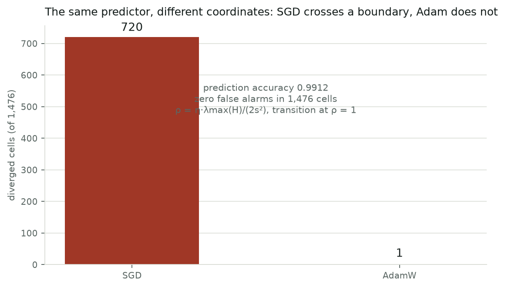

**And then it failed.** On nonlinear models, 96 of 96 configurations at `ρ ≥ 1.1` converged anyway.
The reason was written in my own pre-registration: `ρ` is computed from curvature *at initialisation*,
and a ReLU network under cross-entropy immediately moves somewhere flatter. The theory describes the
first instant of training, and the first instant is not where the outcome is decided.

## IV.5 The dimension law, and why seven searches were doomed

How many independent things can a network's outputs tell you about its parameters?

```
rank(J) = min(n(C−1), P − g_arch)
d_free  = max(0, P − g_arch − n(C−1))
```

`n` samples, `C` classes, `P` parameters, and `g_arch` the gauge freedoms — the directions that
change nothing:

- **softmax common mode**: adding a constant to all logits changes nothing. `h_last + 1` directions.
- **positive homogeneity**: if `φ(cx) = cφ(x)`, then `(W₁, W₂) → (cW₁, W₂/c)` is exact. `h` more per
  homogeneous layer.

So tanh gives `h+1` and ReLU gives `2h+1`. Predicted before measuring. Confirmed 8 out of 8.

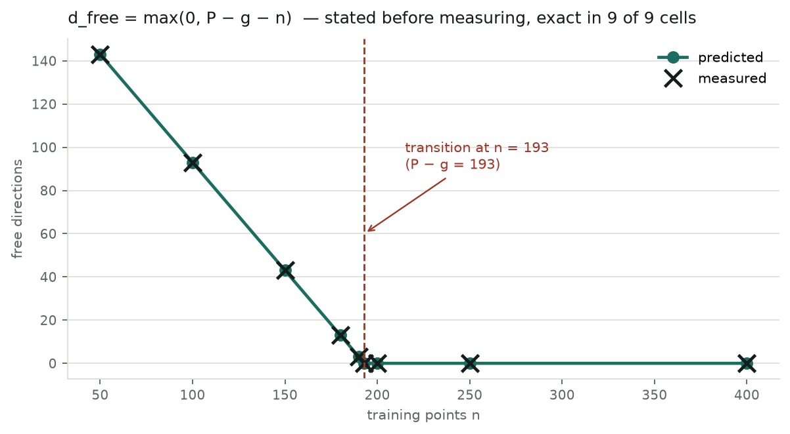

Why it matters: I had spent seven searches looking for functions of a trained model that predict
something about it. The law says how much information is even *available*. Several of those searches
were asking for more than exists.

**All three frozen attempts to confirm this law still failed.** The substance held 126 out of 126,
but my measurement probe used 400 samples, and 400 samples cannot saturate the rank when
`P − g > 400(C−1)`. Exactly 21 mismatches — three configurations times seven values. I diagnosed it
precisely, and it is *still* recorded as a failure, because I changed the measurement after seeing
the result. That rule cost me a defensible finding and I would keep it.

## IV.6 How to not fool yourself: the freeze protocol

1. Write the prediction down, including thresholds and kill conditions.
2. Serialise it and take a SHA-256 hash.
3. The test **reads its thresholds out of the frozen record**, and verifies the hash when it loads,
   so the code cannot drift away from the prediction it is supposed to be testing.
4. One attempt. Record the verdict whichever way it comes out.

> **A frozen prediction whose hash cannot be re-verified from disk is not frozen.** One of mine
> didn't round-trip, because integer dictionary keys sort numerically in memory and
> lexicographically after a JSON reload. I caught it before any evidence existed, and it changed the
> procedure permanently.

---

# BOOK V — Q-NEURO PULSE

## V.1 The promise of adaptive computation

Some inputs are easy and some are hard. A fixed-depth network spends the same compute on both. If a
model could stop when it is done, you would save real time.

The catch, which this book is mostly about, is that *when* you save time depends on how you run the
model, and the honest answer is "in a narrower set of circumstances than anyone advertises."

## V.2 The task, and two attempts to build it

I needed a task with a *known* correct amount of computation, so I could tell the difference between
a model that stops at the right time and one that stops early and guesses.

**Chain following.** A permutation of 24 nodes forms a single cycle. Start somewhere; report how many
hops until you reach node 0. The correct number of steps is the distance. Guessing gives 0.136.

> **Attempt one was unsolvable.** The target was ambiguous given the input, and all ten candidate
> architectures returned exactly 0.1441. Ten different models agreeing to four decimal places is not
> a finding about models; it is a finding about your task. The test suite now verifies that the
> permutation is a single cycle and that the declared answer matches an actual walk.

## V.3 The ladder

Each rung changes exactly one thing.

| model | halting rule | params | accuracy | steps |
|---|---|---:|---|---:|
| `Q0Fixed` | always 8 steps | 28,360 | 1.0000 | 8.00 |
| `Q1Elastic` | PonderNet-style mixture | 28,425 | 0.6241 | 3.27 |
| `Q2Commit` | hard commit | 28,425 | 0.9999 | 8.00 |
| `Q3Arrival` | halt on detected arrival | **27,970** | 0.9994–1.0000 | **4.54** |
| `Q4Grounded` | Q3 + position grounding | 27,970 | 0.6322–0.9500 | 4.50–5.33 |

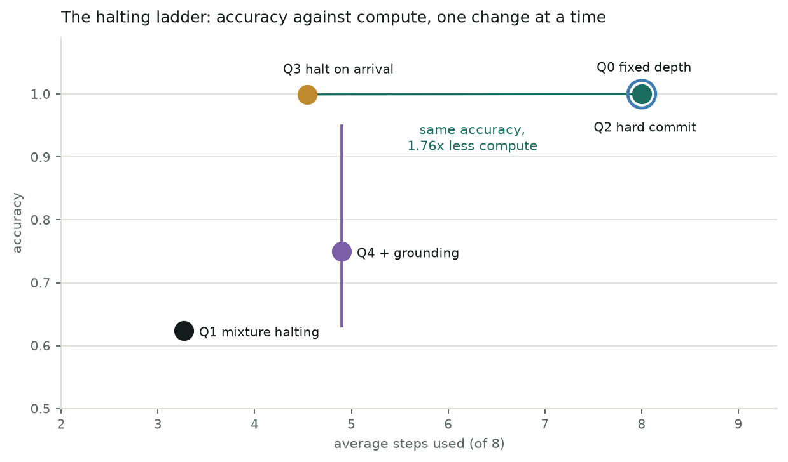

Read the ablations across the rungs:

| change | effect | what it means |
|---|---|---|
| shared → separate key/value | ≤0.136 → 1.0000 | chain following needs an associative lookup |
| fixed depth → mixture halting | 1.0000 → 0.6241 | ponder collapse |
| mixture → hard commit | 0.6241 → 0.9999 | the mixture was the defect, not the halting |
| commit → halt on arrival | 8.00 → 4.54 steps | the saving is real |
| + position grounding | bimodal → 0.63–0.95 | variance cured by destroying the good mode |

> **The bug in the first row is worth dwelling on.** Chain following is an associative lookup: match
> the current node against its identity, read its successor. My first version used one embedding for
> both roles, which makes the lookup mathematically impossible. Everything sat at chance and I nearly
> concluded that recurrent chain-following does not work.

## V.4 The number that was real and not reportable

`Q3Arrival` reached 1.0000 accuracy at 4.54 steps against a fixed-depth 8.00. A 1.76× saving with no
accuracy cost.

Then I ran it twenty times.

**Seven of twenty** reached 0.99. The distribution is bimodal, with nothing at all between 0.5664 and
0.9994. It either learns the mechanism or it doesn't, and the seed decides.

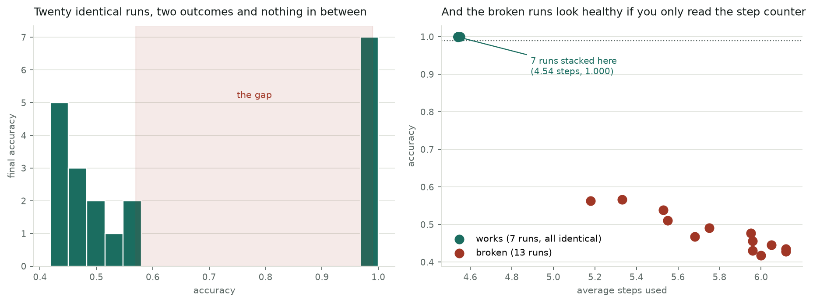

The matched control settles it: `Q0Fixed` under identical conditions is **10 of 10**, worst case
0.9919. The task is fine. The budget is fine. The architecture is unreliable.

**The fix** is one line: RMS-normalise the state after each hop. In the variant sweep it takes the
baseline from 3 of 6 seeds to **6 of 6**, and it then confirmed at **20 of 20**, every success
landing on exactly 1.0000 at 4.54 steps.

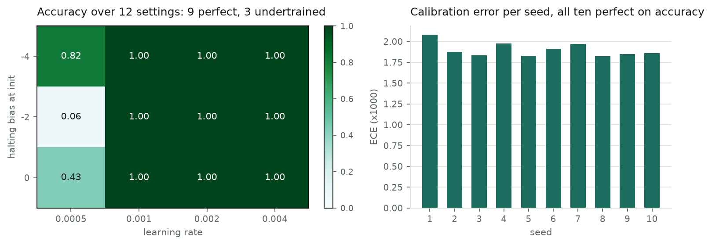

And here is the part that makes it a real finding rather than a trick: **the same normalisation
destroys the fixed-depth model**, taking it from 1.0000 to 0.1281–0.2483. It is an interaction, not
an improvement. An unnormalised residual state carries magnitude information the distance readout
uses; the halting model needs that magnitude removed and the fixed model needs it kept.

## V.5 The lockstep ceiling, derived

Now the part I did not see coming.

An adaptive model saves time per example. But you do not serve one example at a time; you serve
batches. And in a batch executed in lockstep, every example runs until the last one halts. From I.8:

```
E[max] = Σ_k k · ( F(k)ⁿ − F(k−1)ⁿ )
```

| batch | 1 | 8 | 32 | 64 | 256 | 1024 |
|---|---:|---:|---:|---:|---:|---:|
| E[max halt] | 4.97 | 12.53 | 18.22 | 20.96 | 25.86 | 29.42 |
| realisable saving | 6.43× | 2.55× | 1.76× | 1.53× | 1.24× | 1.09× |

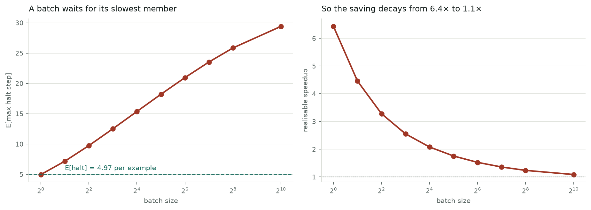

I froze this as a prediction — 2.78× at batch 1 decaying to a ceiling at batch 256 — and it is the
**one prediction out of nineteen that passed all its clauses**. Measured: accuracy 1.0000 versus
1.0000, mean steps 6.14 against a theoretical 6.14, 2.78× at batch 1, and 0.97× at batch 256.

## V.6 Nominal versus realised compute

The correct statement of what I found took me three tries to write:

- **Wrong**: "batching destroys adaptive computation."
- **Also wrong**: "adaptive computation doesn't work."
- **Right**: *under lockstep batched execution*, the realised saving is governed by `E[max halt]`
  rather than `E[halt]`, and that ratio approaches 1 as the batch grows.

The qualifier is the whole finding. Change the execution policy and the ceiling moves.

**Active-set compaction**: after each step, gather the rows that are still running and continue with
only those. Executed rows drop from `n · max dᵢ` to `Σ dᵢ`.

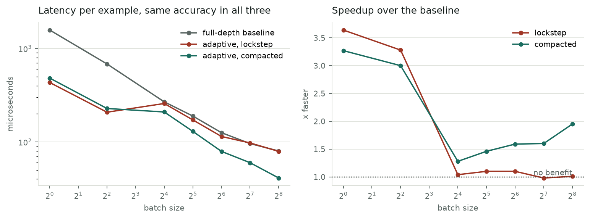

At batch 256 that is 1.95× on the expensive core. On a cheap core, where a step costs 0.33 µs and the
gather costs 31.56 µs, it is 1.07× — barely worth doing. **The mechanism's value is a property of the
hardware, not of the method**, which is a much less exciting claim and the true one.

> **A real bug the equivalence check caught.** With deferred compaction, a row that has already fired
> keeps being advanced until the next gather, and since its halting probability stays above
> threshold, it overwrites its own answer with a later step's logits. 13 wrong rows at batch 16, 215
> at batch 256. Every policy in this project is required to produce *identical* answers, and that
> check is what found it. A timing table would have shown nothing.

## V.7 Why a working efficiency mechanism did not become an architecture

Then I tried it on real data: UCI HAR, human activity recognition from phone sensors, with the
canonical subject-disjoint split fixed before I looked at anything.

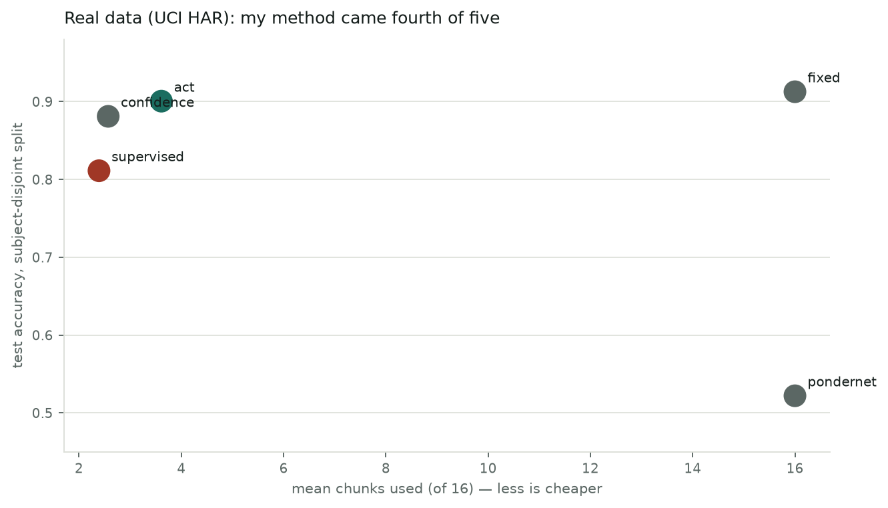

| arm | accuracy | mean chunks | train time |
|---|---:|---:|---:|
| fixed depth | 0.9127 | 16.00 | 3.6 s |
| **ACT (2016)** | **0.9006** | **3.61** | 4.5 s |
| confidence exit | 0.8811 | 2.57 | 3.4 s |
| confidence, matched compute | 0.8747 | 2.28 | 3.4 s |
| **mine** | **0.8112** | 2.39 | **8.4 s** |
| PonderNet (2021) | 0.5220 | 16.00 | 4.3 s |

Fourth of five, and the slowest to train. A 2016 method dominates it on both axes.

**The scope condition that follows**: supervised halting earns its place only where the task supplies
a halt target. My synthetic task supplies one by construction. Activity recognition does not, so the
supervision has to be invented, and invented supervision is worse than no supervision.

That is the honest end of Pulse: a real mechanism, a correct analysis, a working runtime, and a
niche narrow enough that I cannot recommend it over a method from 2016.

---

# BOOK VI — DISCOVERING NOVA

## VI.1 The design of a search that can fail fast

After Pulse I stopped trying to improve one idea and built a laboratory instead: a fixed protocol,
one flag changed per variant, an append-only registry, and a few dozen architectures run through it —
32 of them scored on the final capability matrix.

The protocol, identical for everything: AdamW at 3e-3 with a one-cycle schedule, 2400 steps, batch
64, gradient clipping at 1.0, about 120,000 parameters, three seeds fixed in advance, trained at
sequence lengths 8–16 and evaluated at 16, 32 and 64.

**Length extrapolation is the discriminating axis.** At the training length, everything works. At
four times the training length, the differences between architectures are enormous.

## VI.2 Audit the instrument before trusting it

Before comparing anything, I tried to solve my own eight tasks with three deliberately stupid
predictors: position only, current token only, previous token only.

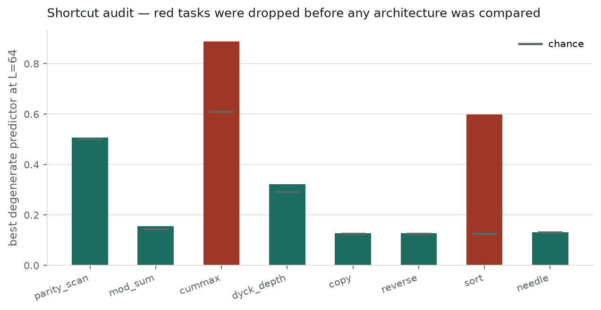

| task | chance | position only | verdict |
|---|---:|---:|---|
| parity_scan | 0.501 | 0.501 | keep |
| mod_sum | 0.145 | 0.143 | keep |
| copy | 0.126 | 0.125 | keep |
| reverse | 0.126 | 0.125 | keep |
| needle | 0.131 | 0.116 | keep |
| **cummax** | 0.609 | **0.887** | **drop** |
| **sort** | 0.126 | **0.598** | **drop** |

Two of my eight tasks were broken. My weak MLP control had scored **0.917 on sort** — without this
audit, that is a discovery. Both were dropped from headline scoring before any candidate was
compared, which is the only order in which that decision is honest.

## VI.3 The baselines, and the inconvenient result

Ten established architectures, all matched to ~120k parameters, all causal, all verified finite.

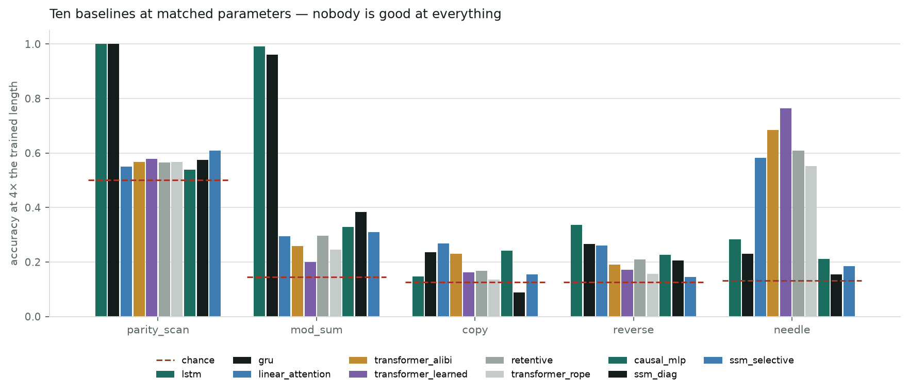

The result that shaped everything after it:

- **State tracking** is solved by the LSTM: parity 1.000, mod_sum 1.000.
- **Retrieval** is solved by attention: needle 1.000 when attached to a recurrence.
- **Ordered memory** — copy and reverse — is solved by **nobody**. Best copy 0.470, best reverse
  0.371, against chance of 0.126.
- The architectures that claim to do both (linear attention, retention, selective SSM) are mediocre
  at each: 0.55 parity, 0.30 mod_sum, 0.58 needle.

So the gap in the field is not "no architecture is good." It is that **no architecture is good at
everything at once**, and the obvious fix — bolt the two together — is what the next three hypotheses
tested.

## VI.4 Hypothesis 1 — dilution

*Softmax attention is not length-invariant: adding non-matching keys takes probability mass and
shifts the read. A read that ignores the number of non-matching candidates should extrapolate where
softmax does not.*

The mechanism checks out at the operator level. Read drift from 24 distractors:

| softmax | log-likelihood | max | threshold |
|---:|---:|---:|---:|
| 0.7243 | 0.5277 | **0.2356** | **0.2356** |

Three times more length-invariant. Real, measurable, exactly as predicted.

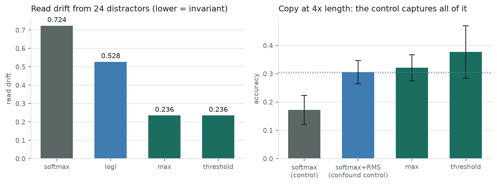

Then the task result, five seeds, copy at 4× length:

| softmax (control) | softmax + RMS (confound control) | max | threshold |
|---:|---:|---:|---:|
| 0.172 ± 0.051 | **0.305 ± 0.041** | 0.321 ± 0.046 | 0.377 ± 0.093 |

**The confound control captures the entire effect.** Each of my candidate normalisers needed a
post-read RMS normalisation to train stably. The control didn't have one. Once the control gets one
too, `max` is inside noise of it. Needle is flat across all four arms.

> **Two bugs, and only one of them is a coding bug.** First: my `max` normaliser divided by the sum
> at the end, which makes it *algebraically exactly softmax*. It produced numbers identical to the
> control to three decimal places, which is how I caught it — and until that point I had not tested
> my hypothesis at all. Second: I built the candidate before the control. In between, I believed
> something false.

## VI.5 Hypothesis 2 — interference

An LSTM alone gets 0.992 on mod_sum at 4× length. The same LSTM with attention attached gets 0.291.
The attention branch is *costing* the model a capability it demonstrably has.

Two explanations. **Override**: the recurrence still learned the automaton and attention drowns it
out. **Pre-emption**: the recurrence never learned it, because attention fitted the training lengths
first and removed the pressure.

I froze a prediction that handicapping the attention branch would let the recurrence come back. Four
clauses; all four failed.

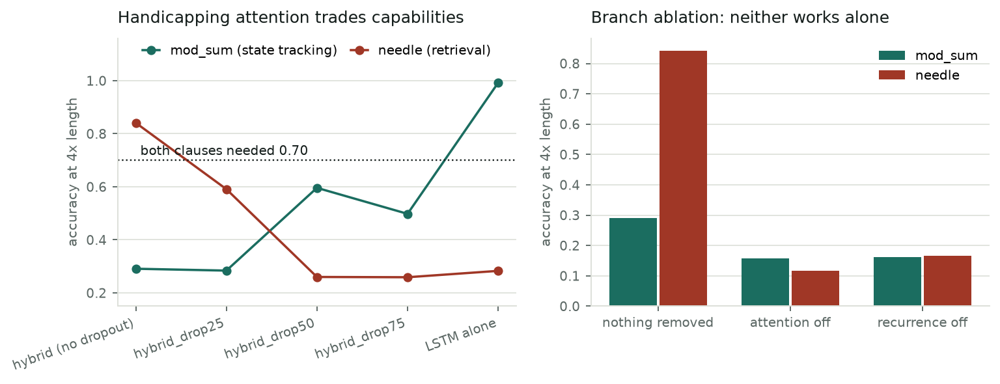

| arm | mod_sum | needle |
|---|---:|---:|
| no dropout | 0.291 | 0.841 |
| dropout 50% | 0.596 | 0.260 |
| LSTM alone | **0.992** | 0.283 |

Mod-sum improves, but needle collapses. At 50% dropout the model has essentially *become* an LSTM.
You cannot buy state tracking without selling retrieval.

**The intervention that actually answered it** costs nothing: zero each branch at test time, without
retraining.

| ablation | mod_sum @64 | needle @64 |
|---|---:|---:|
| nothing removed | 0.291 | 0.841 |
| attention off | 0.157 | 0.117 |
| recurrence off | 0.161 | 0.167 |

Neither branch works alone. Removing attention makes state tracking **worse**, not better. So the
recurrence never learned the automaton — this is pre-emption. The model found a joint solution that
needs both routes and does not extrapolate.

## VI.6 Hypothesis 3 — composition

If the two capabilities conflict, give them *disjoint parameters* and let a gate combine them.

Frozen criteria: mean ≥ 0.75 across the clean tasks, and no task more than 0.15 below the best
anyone achieves on it.

Measured: mean **0.692** against 0.75. Reverse **0.146** against a per-task best of 0.371 — a gap of
0.225 where 0.15 was allowed. One clause did pass: mod-sum went from 0.776 to 0.998 while needle
stayed at 0.977, so the *specific* conflict I was targeting really was resolved.

**The conflict moved.** Solving the state/retrieval trade-off did not produce a general model; it
produced a model that fails somewhere else. That is a finding, and it is the one I would build on if
I continued.

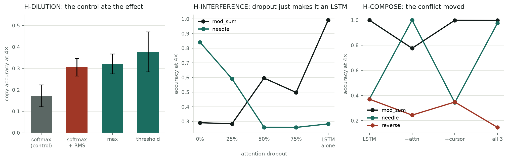

## VI.7 The winner was a 2014 paper

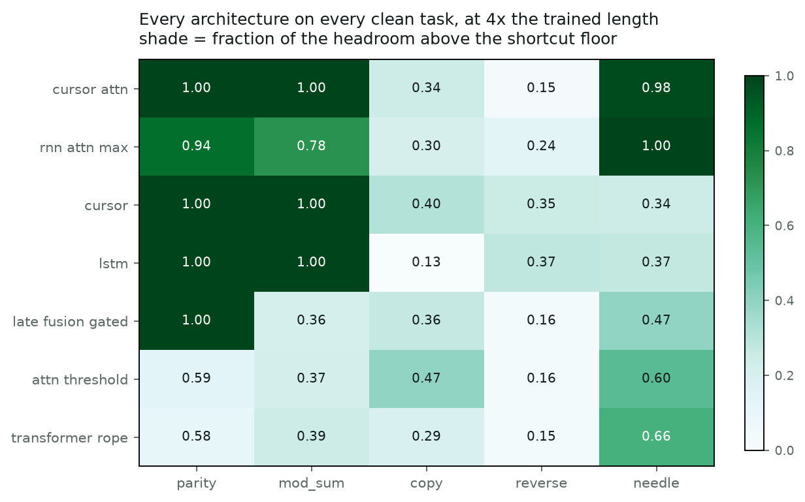

| architecture | parity | mod_sum | copy | reverse | needle | mean |
|---|---:|---:|---:|---:|---:|---:|
| cursor_attn | 1.000 | 0.998 | 0.340 | 0.146 | 0.977 | **0.692** |
| rnn_attn_max | 0.937 | 0.776 | 0.301 | 0.244 | 1.000 | 0.652 |
| cursor | 1.000 | 0.999 | 0.398 | 0.348 | 0.344 | 0.618 |
| lstm | 1.000 | 1.000 | 0.126 | 0.371 | 0.371 | 0.574 |
| transformer_rope | 0.580 | 0.389 | 0.291 | 0.153 | 0.656 | 0.414 |
| *chance* | *0.501* | *0.145* | *0.126* | *0.126* | *0.131* | |

The best configuration is a composition of an LSTM, NTM-style location addressing, and attention. All
three are prior art. The cursor mechanism — a learned relative shift over a memory — is Graves et
al., 2014, section 3.3.2, and my version is a weaker reproduction of it.

**The verdict is NO. No new superior architecture survived.**

---

# BOOK VII — THE NOVA ARCHITECTURE

## VII.1 What was actually built

`cursor_attn` carries three routes and gates between them:

1. an **LSTM** for running state,
2. a **cursor** — a pointer into memory that moves by a learned relative shift,
3. **content-addressed attention** for retrieval.

## VII.2 The cursor, precisely

The cursor is a probability distribution `c` over memory positions. Each step the model emits a shift
distribution `s` over `{−1, 0, +1}` and convolves:

```python
c_next = conv1d(c, s)          # circular shift, differentiable
read    = (c_next[:, :, None] * memory).sum(1)
```

This is *location* addressing rather than *content* addressing: "one to the left of where I was"
rather than "wherever the thing that matches is." It is exactly why the cursor is the best of the
state-tracking models on copy (0.398, against 0.126 for the LSTM) while content-addressed attention
is the one that solves needle (1.000).

## VII.3 A worked forward pass, by hand

Memory of 4 positions holding `[a, b, c, d]`, cursor at position 0, so `c = [1, 0, 0, 0]`.

- Emit `s = [0, 0, 1]` (shift right). Then `c_next = [0, 1, 0, 0]` and the read is `b`.
- Emit `s = [0, 1, 0]` (stay). `c_next = [0, 1, 0, 0]`, read `b` again.
- Emit `s = [0.5, 0, 0.5]`. `c_next = [0.5, 0, 0.5, 0]`, and the read is `0.5a + 0.5c` — a blend,
  which is what makes it differentiable and also what makes it degrade over long sequences as the
  distribution smears.

That smearing is my best guess at why copy tops out at 0.398 rather than 1.000, but I did not prove
it, so it stays a hypothesis.

## VII.4 Training

Same protocol as everything else — that is the point. 2400 steps, AdamW 3e-3 one-cycle, batch 64,
111,191 parameters, three seeds.

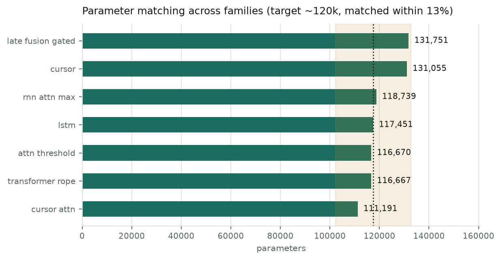

---

# BOOK VIII — WHY NOVA DID NOT WORK

Sorted by how strongly I can defend each claim, which is a distinction I did not know to make when I
started.

## VIII.1 Causally demonstrated

**Capability competition is real and conserved.** Every intervention that improved one capability
degraded another. Branch dropout: mod_sum 0.291 → 0.596, needle 0.841 → 0.260. Disjoint parameters:
mod_sum 0.776 → 0.998, and reverse falls to 0.146. Test-time ablation shows neither branch functions
alone.

**Ordered memory does not extrapolate, for anything.** Copy best 0.470, reverse best 0.371, against
0.126 chance, across every architecture and every mechanism tested.

## VIII.2 Strongly supported

**The composition is prior art.** Every mechanism in the best model has a citation older than this
project.

**No single model reaches the collective frontier.** Best mean 0.692; the best-per-task collection
reaches 0.768. The single model gets 90% of it, and the shortfall is entirely concentrated in
specific columns.

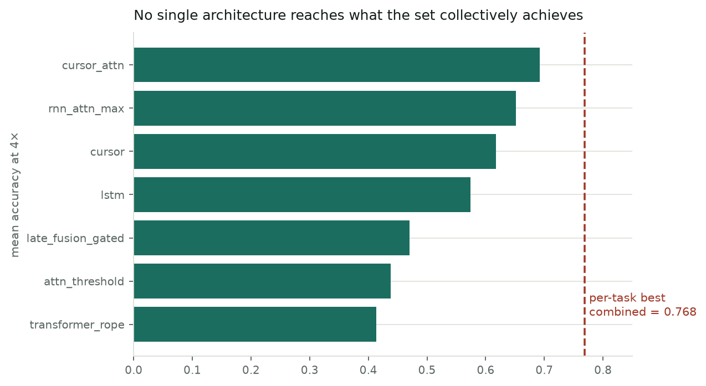

## VIII.3 Hypothesised

**Why** competition is conserved I do not know. Gradient starvation (Pezeshki et al., 2020) is the
closest existing account: a branch that fits the training distribution faster removes the pressure
for the other to learn anything. That is consistent with everything I measured and I did not test it
directly.

---

# BOOK IX — SCALING

## IX.1 What scaling laws say

Loss falls as a power law in parameters, data and compute. The exponents are stable across many
orders of magnitude, which is why scaling is predictable.

## IX.2 What my work can and cannot say

**Cannot**: anything about scale. Everything here is ~120k parameters on one CPU. A mechanism that
loses at 120k might win at 120M. I have no evidence either way and I will not pretend otherwise.

**Can**: something about *shape*. Length extrapolation at fixed size is a different axis from scale,
and the ordering it produces is not the ordering you get from accuracy at the training length. A
RoPE transformer and an LSTM, matched at ~120k parameters, score 0.414 and 0.574 across the clean
tasks at 4× the trained length — and on copy the transformer reaches 0.996 at the training length
and 0.135 at four times it, which is chance.

The honest summary is that I measured a real axis on a small budget, and the result is a hypothesis
about larger models rather than a claim about them.

---

# BOOK X — ENGINEERING ON APPLE SILICON

## X.1 The machine

| | |
|---|---|
| Machine | M2 MacBook Air, fanless |
| Memory | 8.0 GiB, 2.08 GiB free |
| Cores | 8 physical, 4 torch threads |
| CPU↔MPS crossover | **65,536 elements**, measured |

Nothing in this project reaches 65,536 elements, so it all runs on CPU. That is a measurement, not a
preference. And I use half the free memory deliberately: the machine has no fan, and a model that
swaps benchmarks your SSD instead of your idea.

## X.2 The constants that govern small models

| | lookup core | streaming core |
|---|---:|---:|
| per example-step | 2.66 µs | 0.33 µs |
| per iteration launch | 119.65 µs | 49.97 µs |
| per compaction | 87.33 µs | 31.56 µs |

## X.3 Execution policies

Four, all producing identical answers:

| policy | executed rows |
|---|---|
| lockstep | `n · max dᵢ` |
| compacted | `Σ dᵢ` |
| bucketed | in between |
| continuous | `Σ dᵢ`, constant width |

## X.4 The measured frontier

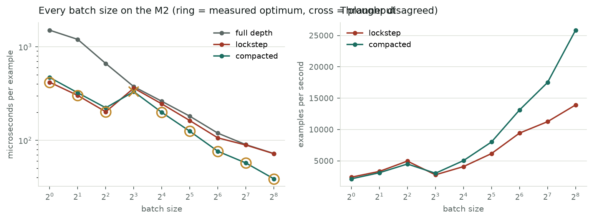

At batch 1 lockstep wins at 417.5 µs per example; at batch 256 compaction wins at 38.7 µs. Throughput
13,872/s → 25,841/s. Peak activation memory 1,536 KiB → 457 KiB.

The planner picks the measured optimum at 8 of 9 batch sizes and is conservative at the ninth, where
compaction wins by 1.09%.

> **Measured RSS deltas are all 0.00**, because `ru_maxrss` is a high-water mark that never comes
> back down. That is why the memory figure is analytic, and why I say so instead of quietly reporting
> the analytic number as measured.

## X.5 The cost model, and its failure

```
T = c_step · rows + c_launch · iterations + c_compact · compactions
```

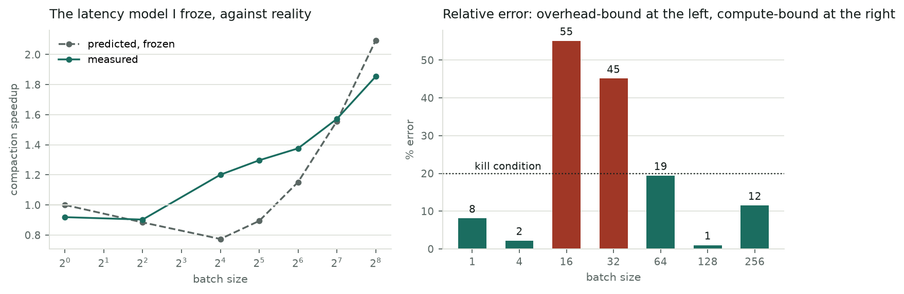

I froze a crossover prediction from this and it **failed**: 1.0% error at batch 128, 55% at batch 16.
The model over-charges compaction at small batch — 15 modelled compactions against 10 measured.

The kill condition triggered, so the equation was **not** patched and re-issued as if it had worked.
It sits in the repository as a failed prediction with its diagnosis attached, and the shipped planner
uses measured thresholds instead of the equation.

---

# BOOK XI — HOW NOT TO FOOL YOURSELF

This is the most useful chapter in the book, and it is entirely made of my own mistakes.

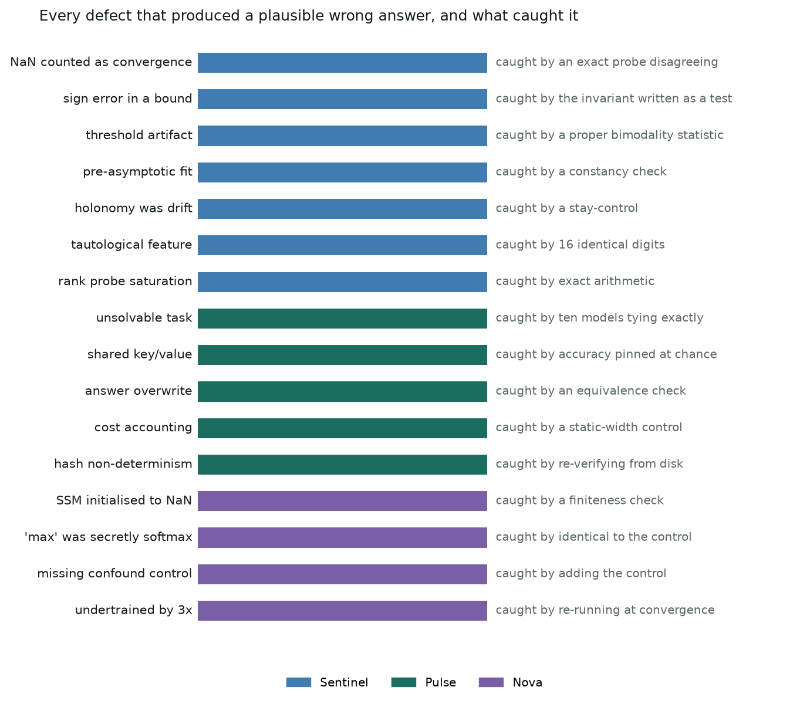

## XI.1 The catalogue

| defect | what it claimed | why | what caught it |
|---|---|---|---|
| NaN misclassification | runaway runs **converged** | a norm overflows first, so `nan > t` is `False` | an exact probe disagreeing |
| sign error | ratios below 1.0 | `S⁻¹` applied twice | the invariant written as a test |
| threshold artifact | 6/16 systems bifurcate | crossings of an arbitrary line | a real bimodality statistic |
| pre-asymptotic fit | a clean exponent | fitting inside a transient | a constancy check |
| holonomy | a geometric phase | convergence drift | a stay-control |
| tautological feature | perfect agreement | two features were the same feature | 16 identical digits |
| probe saturation | a law violated | 400 samples cannot saturate rank | exact arithmetic |
| unsolvable task | ten models tie | the target was ambiguous | all ten returning 0.1441 |
| shared key/value | recurrent lookup fails | the lookup was impossible | accuracy pinned at chance |
| SSM NaN | "not causal" | `log()` of negatives | a finiteness check |
| normaliser identity | a novel operator | it was algebraically softmax | identical to the control |
| missing control | length invariance helps | normalisation only on candidates | adding the control |
| undertraining | catastrophic interference | 800 steps is not convergence | re-running at 2400 |
| weak instrument | a discovery on `sort` | position alone scores 0.598 | the shortcut audit |
| hash non-determinism | a frozen prediction | keys sort differently after JSON | re-verifying from disk |
| cost accounting | a 2× Pareto win | control charged for one step of many | the static-width control |

## XI.2 The rules that fell out

1. **Audit the instrument before the hypothesis.** Two of my eight tasks were broken, and I found out
   late and by accident.
2. **Write the confound control at the same time as the candidate.** Not after. In between, you will
   believe something false.
3. **Check the training budget before believing an effect size.** Mine was three times too large for
   days.
4. **Never report compute without accuracy.** A broken adaptive model reports a beautiful step count.
5. **Test for finiteness before you test for anything else.** Otherwise your diagnostics lie.
6. **Match parameters, not width.** This is the one that killed Helix.
7. **A frozen prediction that can't be re-verified from disk is not frozen.**
8. **If you change the measurement after seeing the result, the result is compromised** — even when
   the change is correct. Especially then.

---

# BOOK XII — SCIENTIFIC PREDICTION

## XII.1 From model to instrument

A model becomes an instrument when it makes a *quantitative* prediction with a *stated* threshold
*before* the data exists. Anything else is description.

## XII.2 Predictive is not causal

The stability boundary predicts 99.12% of 1,476 outcomes and predicts *nothing* about nonlinear
models. Same equation, same quality of fit, no transfer. A model that predicts well inside its
domain tells you nothing about its domain's edges unless you go and find them.

## XII.3 What went wrong when I tried

Nineteen frozen predictions, one pass. That is a 5% hit rate, and it is the honest number for someone
guessing at mechanisms from first principles without the literature memorised.


The three most instructive failures:

- **Gate D** — the conjecture held inside a model family and collapsed across families. Scope is a
  property you have to measure, not one you can reason your way into.
- **DFREE-LAW** — right substance, wrong instrument. The law held 126/126 and the probe could not see
  it.
- **RUNTIME-P1** — right where compute dominates, wrong where overhead does. Two regimes, one
  equation.

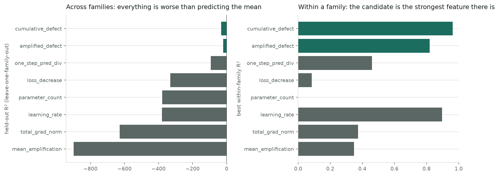

---

# BOOK XIII — BIOLOGY, THE PREREQUISITES

I originally wanted to justify all of this with neuroscience. Here is why I stopped.

Real neurons are not units in a layer. They spike; they have dendritic trees that compute; they are
modulated by chemistry on timescales from milliseconds to days; they exist in a body. "Neural
network" is a metaphor that stopped being literal in about 1960.

The specific claim I abandoned: that complex-valued state models neural oscillation and phase
coding. Oscillations are real and phase coding is a real hypothesis in neuroscience. But my complex
layer **realifies exactly** into a constrained real layer — so whatever it was doing, it was not
doing anything a real network cannot do. The biology was decoration on a piece of linear algebra.

**The rule I now apply**: if removing the biological justification changes no line of code and no
number in a table, the justification was never doing any work, and keeping it is a way of making a
result sound more important than it is.

---

# BOOK XIV — PREDICTIVE MEDICINE, AND A BOUNDARY I DID NOT CROSS

At one point I wanted this to be medically useful. It is worth writing down exactly why I stopped,
because the reasoning generalises.

**The ladder.** Statistical association → predictive validity on held-out patients → external
validity in a different hospital → clinical utility (does acting on it help?) → regulatory approval.
You cannot skip rungs, and each rung has failed things that cleared the one below it.

**What evaluation would require.** Real patient data with consent and ethics approval; a
prospectively defined endpoint; a comparison against current clinical practice rather than against
chance; calibration, not just discrimination; and subgroup analysis, because a model can help on
average and harm a subgroup.

**Where I actually am.** I have a mechanism that comes fourth of five on a public phone-sensor
dataset of 30 volunteers doing six everyday activities. That is rung zero.

**So the claim I make is nothing.** No clinical validity is claimed anywhere in this project. Not
"promising," not "potential applications in." The nearest true statement is: this is an adaptive
computation method for sequence models, evaluated on synthetic tasks and one public activity-
recognition benchmark, on which it is outperformed by a method from 2016.

---

# BOOK XV — THE FAILURE ATLAS

Thirty-nine preserved failures, each with an ID, a description, and the evidence. They are in the
repository under `research/failures.json` and `docs/FAILED_IDEAS.md`, and none of them has ever been
renamed and re-run.

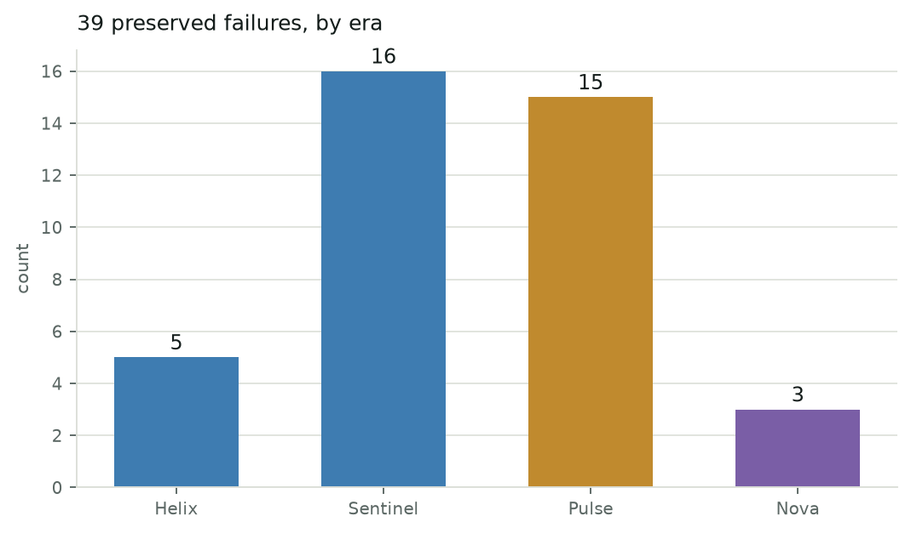

The taxonomy that emerged:

| kind | example | how to avoid it |
|---|---|---|
| **missing control** | Helix's parameter mismatch | write the control first |
| **broken instrument** | cummax, sort | audit before comparing |
| **implementation identity** | `max` was softmax | check your candidate differs from the control numerically |
| **numerical** | SSM NaN, `nan > t` is `False` | test finiteness first |
| **scope error** | Gate D | measure the boundary, don't reason about it |
| **budget** | 800 steps | verify convergence before measuring an effect |
| **accounting** | width routing | count what the control actually spends |
| **procedural** | hash round-trip | verify from disk |

The reason to preserve them is not confession. It is that **a failure with a diagnosis is reusable
and a failure without one repeats**. Six of the eight categories above caught a *second* problem
later, because once you know a category exists you check for it.

---

# BOOK XVI — OPEN PROBLEMS

The things I could not do, stated so that someone else can pick them up.

**1. Why does ordered memory not extrapolate?** Every architecture tested fails copy and reverse at
4× length; the best anything reaches is 0.470 on copy and 0.371 on reverse, against chance of 0.126.
Among the models that also track state, the cursor gets furthest, and I suspect its distribution
smears over long sequences — but I did not prove it. A discrete or sharpened cursor is the obvious
next thing to try.

**2. Is capability competition conserved, or did I only test models too small to escape it?** Every
intervention I ran traded one capability for another. At 120k parameters that could be capacity. The
test is trivial and I could not run it: repeat the interference experiment at 1M and 10M parameters
and see whether the trade-off relaxes.

**3. Where does the stability boundary go for nonlinear models?** `ρ` from initialisation curvature
fails, and the reason is known — the network moves somewhere flatter immediately. Does `ρ` computed
from curvature *after* a short warm-up predict? That is a well-posed question and I ran out of time.

**4. What is the right probe for the dimension law?** The law is right and my instrument was too
small. `n(C−1) > P − g` is the requirement; for a real model that is an enormous number of samples.
Is there a randomised estimator that saturates rank with fewer?

**5. Does supervised halting ever beat ACT on real data?** My scope condition says it needs a task
that supplies a halt target. Such tasks exist — early exit in speech, streaming with an end-of-segment
label. Nobody has run that comparison, including me.

**6. Where does the compaction crossover sit on a GPU?** All my constants are CPU constants on one
fanless machine. On a GPU, launch overhead is larger and per-step work is far cheaper, so the
crossover should move a long way. The code is written to make that a one-afternoon measurement.

---

## What I would tell someone starting

Build the control before the candidate. Freeze the prediction before you look. When something works,
run it twenty times. When something fails, write down why in enough detail that it counts as a
result. And do not fall in love with a mechanism, because the literature has probably had it since
2014 and you will find out eventually — better from your own prior-art search than from a reviewer.

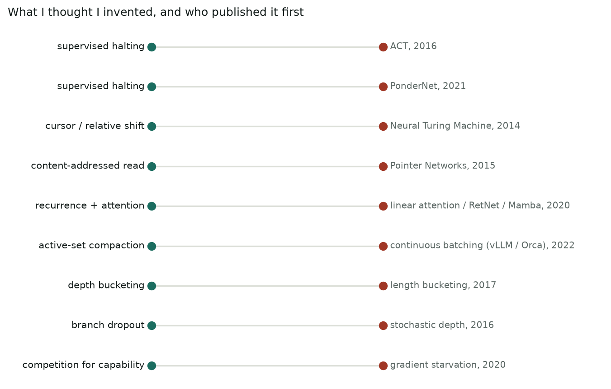

I did not find a new architecture. I found out, precisely and with evidence, why the obvious ways of
looking for one do not work — and I built the machinery that makes that a statement about the world
rather than a statement about me.

That is a smaller result than I wanted. It is a real one.
